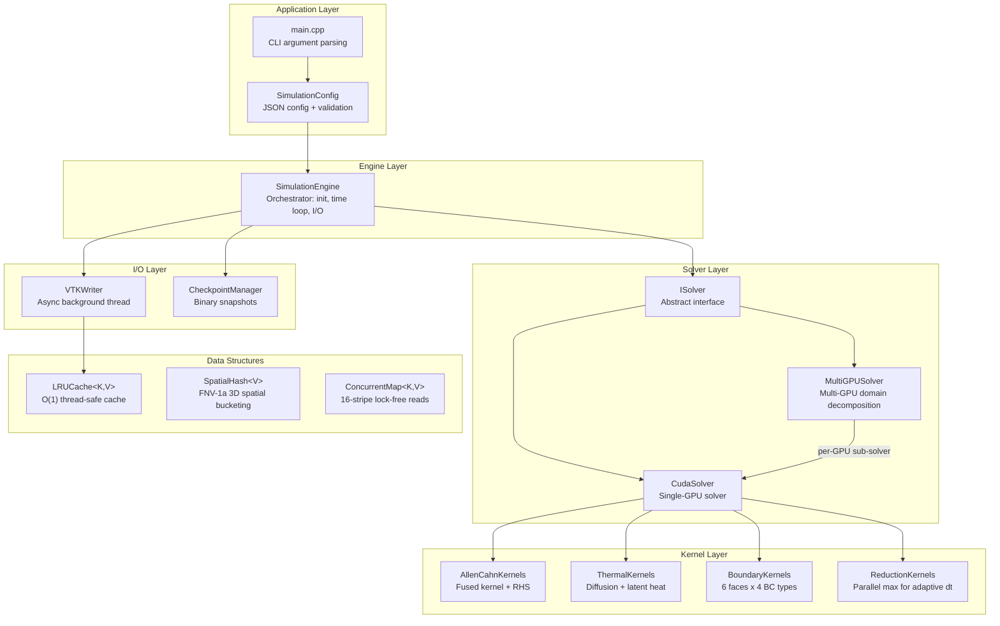
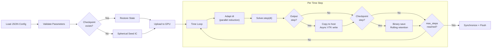
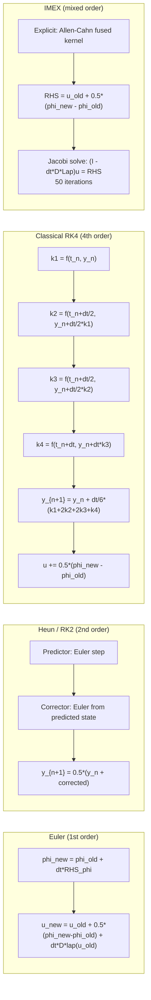
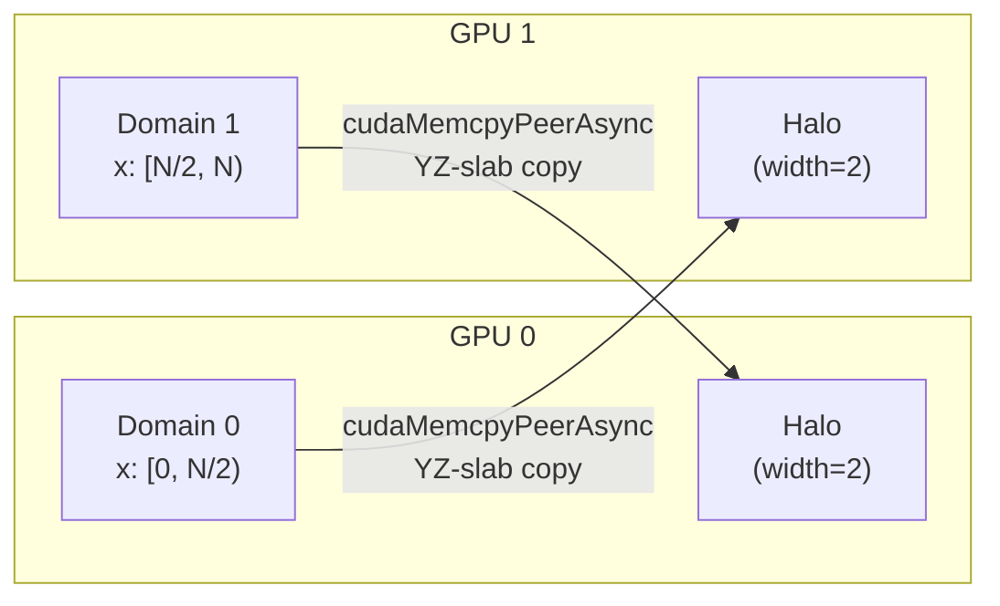

# Allen-Cahn CUDA -- Phase-Field Simulation of Dendritic Solidification

Production-grade GPU-accelerated 3D phase-field simulation of dendritic crystal growth using the coupled Allen-Cahn and thermal diffusion equations from the Kim-Provatas-Goldenfeld-Dantzig (1999) model.

Built with C++23, CUDA 12+, VTK 9, and CMake 3.28+. Designed for critical production environments handling complex solidification problems without simplification.

---

## Features

- **Modern C++23 / CUDA 20** with full RAII, no raw pointers, move semantics throughout
- **Four time integrators**: Euler, Heun (RK2), Classical RK4, IMEX (implicit diffusion + explicit reaction)
- **Kernel fusion**: Single-pass Allen-Cahn kernel eliminates 3 intermediate field arrays (53% GPU memory reduction)
- **O(1) field swap**: Pointer swap replaces expensive data-copy kernels
- **Multi-GPU support**: Domain decomposition along X-axis with cudaMemcpyPeerAsync halo exchange
- **Anisotropic solidification**: Cubic anisotropy A(n) with 4-fold crystal symmetry
- **Two Laplacian stencils**: Standard 7-point and isotropic 27-point (Kumar 2004, 4th-order isotropy)
- **Per-face boundary conditions**: Independent Dirichlet/Neumann/Periodic/Robin on each of 6 faces
- **Adaptive time stepping**: CFL-constrained with tolerance-based control via parallel reduction
- **Async I/O**: Background VTK/raw writer thread with LRU-cached field statistics
- **Binary checkpointing**: Rolling checkpoint retention with full restart support
- **Thread-safe data structures**: LRU cache, spatial hash map (FNV-1a), concurrent striped hash map
- **Comprehensive tests**: 120+ test cases across unit and integration suites
- **Docker infrastructure**: Multi-stage dev/prod/test builds with NVIDIA Container Toolkit
- **Kubernetes orchestration**: Jobs, Deployments, HPA, Kustomize overlays for dev/prod

---

## Architecture Overview



## Simulation Data Flow



## Time Integration Schemes



## Multi-GPU Domain Decomposition



Halo width of 2 accounts for the fused kernel's stencil reach: gradient at neighbor points requires access to points at distance +/-2 from the thread's position.

---

## Dependencies

| Dependency | Version | Required | Notes |
|-----------|---------|----------|-------|
| CMake | >= 3.28 | Yes | Native CUDA language support |
| CUDA Toolkit | >= 12.0 | Yes | CUDA C++20 device code |
| GCC / Clang | C++23 | Yes | GCC 13+ or Clang 17+ |
| nlohmann/json | >= 3.11 | Auto | FetchContent |
| spdlog | >= 1.12 | Auto | FetchContent |
| GoogleTest | >= 1.14 | Auto | FetchContent (tests only) |
| VTK | >= 9.0 | Optional | Structured grid output |
| HDF5 | any | Optional | HDF5 output support |

## Build

```bash
git clone https://github.com/myousefi2016/Allen-Cahn-CUDA.git
cd Allen-Cahn-CUDA

# Release build
mkdir build && cd build
cmake .. -DCMAKE_BUILD_TYPE=Release -DCMAKE_CUDA_ARCHITECTURES=native
cmake --build . -j$(nproc)

# Debug build with tests
cmake .. -DCMAKE_BUILD_TYPE=Debug -DAC_BUILD_TESTS=ON
cmake --build . -j$(nproc)
ctest --output-on-failure
```

## Run

```bash
./allen-cahn-cuda                          # Uses config/default.json
./allen-cahn-cuda config/custom.json       # Custom configuration
./allen-cahn-cuda config/benchmark_small.json  # Small grid for testing
```

## Configuration

All parameters are specified in JSON. See `config/default.json` for defaults.

```json
{
    "physics": { "delta": 0.8, "epsilon": 0.07, "W0": 1.0, "D": 2.0, "d0": 0.5 },
    "grid":    { "Nx": 600, "Ny": 600, "Nz": 600, "dx": 0.4, "dy": 0.4, "dz": 0.4 },
    "time":    { "dt": 0.01, "max_steps": 6000, "scheme": "euler", "adaptive": false },
    "stencil": "7pt",
    "output":  { "frequency": 100, "output_dir": "./out", "format": "vts", "async_io": true },
    "checkpoint": { "frequency": 500, "keep_last": 3 },
    "gpu":     { "device_ids": [0], "multi_gpu": false },
    "boundary": {
        "phi": { "type": "dirichlet", "value": -1.0 },
        "u":   { "type": "dirichlet", "value": -0.8 }
    }
}
```

### Available Options

| Parameter | Options |
|-----------|---------|
| `time.scheme` | `"euler"`, `"heun"`, `"rk4"`, `"imex"` |
| `stencil` | `"7pt"` (standard), `"27pt"` (isotropic, Kumar 2004) |
| `boundary.*.type` | `"dirichlet"`, `"neumann"`, `"periodic"`, `"robin"` |
| `output.format` | `"vts"` (VTK structured grid), `"raw"` (binary) |

### Per-Face Boundary Conditions

Each field can have independent BCs on each of the 6 faces:

```json
{
    "boundary": {
        "phi": {
            "x_lo": { "type": "neumann", "flux": 0.0 },
            "x_hi": { "type": "dirichlet", "value": -1.0 },
            "y_lo": { "type": "periodic" },
            "y_hi": { "type": "periodic" },
            "z_lo": { "type": "robin", "alpha": 1.0, "beta": 0.5, "gamma": 0.0 },
            "z_hi": { "type": "neumann", "flux": 0.0 }
        }
    }
}
```

## GPU Memory Budget (600^3 grid)

| Component | Original Code | Optimized | Savings |
|-----------|--------------|-----------|---------|
| IDx, IDy, IDz (index arrays) | 4.8 GB | 0 GB (computed from thread ID) | 100% |
| Fx, Fy, Fz (force arrays) | 4.8 GB | 0 GB (fused kernel recomputation) | 100% |
| phi_old, phi_new, u_old, u_new | 6.4 GB | 6.4 GB | -- |
| Swap kernel | O(N) memcpy | O(1) pointer swap | ~100% |
| **Total** | **16.0 GB** | **6.4 GB** | **60%** |

## Docker

```bash
# Development environment (mounts source, ccache)
docker compose --profile dev up

# Run test suite
docker compose --profile test up

# Production simulation
docker compose --profile prod up
```

- `docker/Dockerfile.dev` -- Full CUDA 12.6 development environment, non-root user
- `docker/Dockerfile.prod` -- Multi-stage: builder + minimal runtime image
- `docker/Dockerfile.test` -- Builds debug, runs ctest as entrypoint

## Kubernetes

```bash
# Deploy to development
kubectl apply -k k8s/overlays/dev/

# Deploy to production (with HPA autoscaling)
kubectl apply -k k8s/overlays/prod/

# Monitor
kubectl -n allen-cahn-prod get pods
kubectl -n allen-cahn-prod logs -f job/allen-cahn-simulation
```

Manifests include: Namespaces, ConfigMap, PVC, Job (single run), Deployment (scalable workers), HPA (GPU-utilization-based autoscaling).

## Testing

120+ test cases organized into unit and integration suites:

**Unit tests:**
- Grid, Config, FieldData, CheckpointIO (CPU)
- DeviceField, Laplacian stencils, Anisotropy functions, Boundary conditions, Parallel reduction (CUDA)
- CudaSolver: all 4 time schemes, per-face BC, latent heat coupling
- LRU cache, Spatial hash, Concurrent map (thread safety)
- VTK writer: async output, statistics caching

**Integration tests:**
- Sphere regression (dendritic growth from spherical seed)
- Euler convergence (dt refinement error reduction)
- Energy conservation (phase-field free energy monotonicity)
- Scheme comparison (Euler vs Heun vs RK4, IMEX stability with large dt)

```bash
cd build
ctest --output-on-failure --parallel $(nproc)
```

## Project Structure

```
Allen-Cahn-CUDA/
  src/
    core/                  # Grid, Config, FieldData, CheckpointManager
                           # LRUCache, SpatialHash, ConcurrentMap
    cuda/                  # ISolver, CudaSolver, MultiGPUSolver
                           # AllenCahn/Thermal/Boundary/Reduction Kernels
                           # DeviceField (RAII GPU memory), CudaUtils
    io/                    # VTKWriter (async), CheckpointIO (binary)
    logging/               # Logger (spdlog wrapper)
    main.cpp               # Entry point with arg parsing
  tests/
    unit/                  # 16 test files
    integration/           # 4 test files
  config/                  # JSON configuration files
  docker/                  # Dockerfile.dev, Dockerfile.prod, Dockerfile.test
  k8s/                     # Kubernetes manifests (base + dev/prod overlays)
  docs/                    # ARCHITECTURE.md, DESIGN.md
  cmake/                   # Dependencies.cmake (FetchContent)
  CMakeLists.txt           # Top-level CMake
  docker-compose.yml       # Dev/test/prod profiles
```

## Documentation

- [Architecture Guide](docs/ARCHITECTURE.md) -- System design, module dependencies, threading model
- [Design Document](docs/DESIGN.md) -- Algorithms, data structures, mathematical formulation

## References

1. Kim, S.G., Kim, W.T., & Suzuki, T. (1999). Phase-field model for binary alloys. *Physical Review E*, 60(6), 7186.
2. Provatas, N., Goldenfeld, N., & Dantzig, J. (1998). Efficient computation of dendritic microstructures using adaptive mesh refinement. *Physical Review Letters*, 80(15), 3308.
3. Kumar, S. (2004). Isotropic finite-differences. *Journal of Computational Physics*, 201(1), 109–118.

## License

See [LICENSE](LICENSE) for details.
