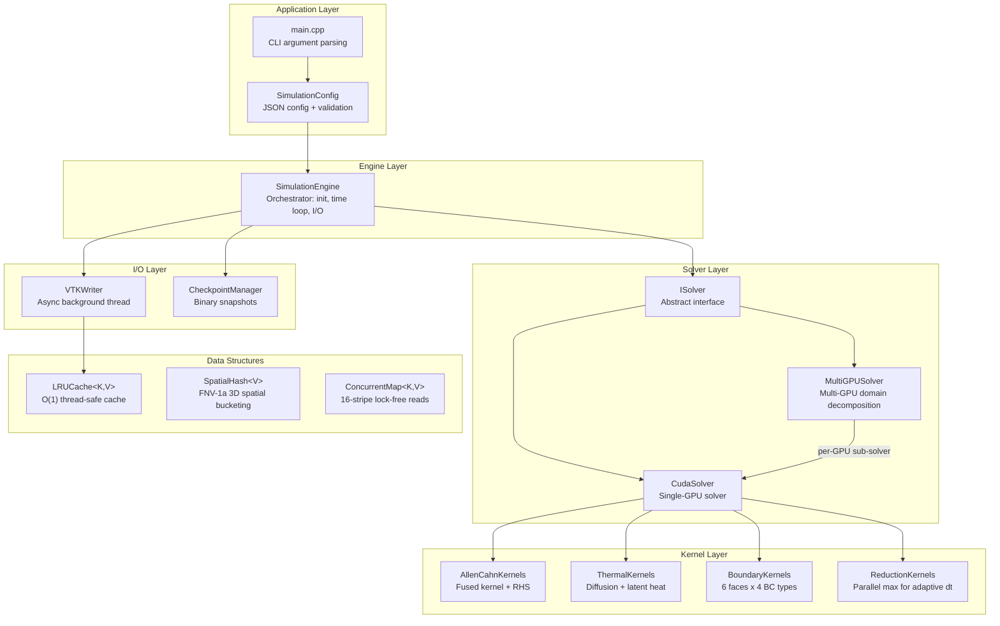
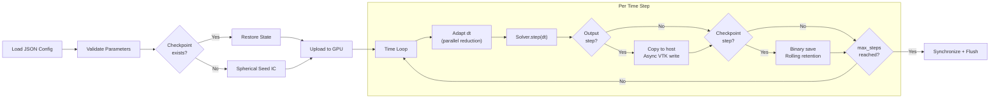
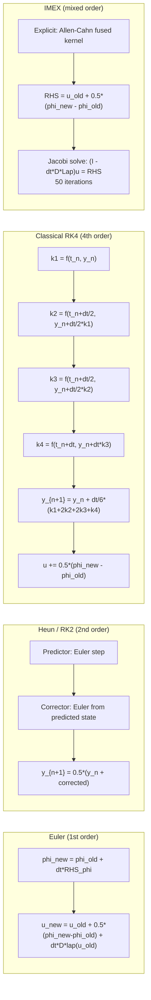
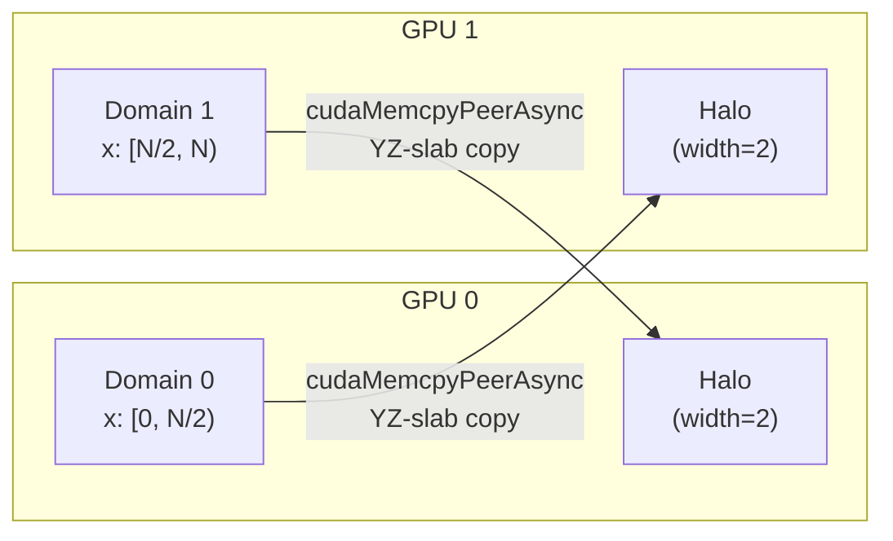

# Allen-Cahn CUDA -- Phase-Field Simulation of Dendritic Solidification

Production-grade GPU-accelerated 3D phase-field simulation of dendritic crystal growth using the coupled Allen-Cahn and thermal diffusion equations from the Kim-Provatas-Goldenfeld-Dantzig (1999) model.

Built with C++23, CUDA 12+, VTK 9, and CMake 3.28+. Designed for critical production environments handling complex solidification problems without simplification.

---

## Features

- **Modern C++23 / CUDA 20** with full RAII, no raw pointers, move semantics throughout
- **Four time integrators**: Euler, Heun (RK2), Classical RK4, IMEX (implicit diffusion + explicit reaction)
- **Kernel fusion**: Single-pass Allen-Cahn kernel eliminates 3 intermediate field arrays (53% GPU memory reduction)
- **O(1) field swap**: Pointer swap replaces expensive data-copy kernels
- **Multi-GPU support**: Domain decomposition along X-axis with cudaMemcpyPeerAsync halo exchange
- **Anisotropic solidification**: Cubic anisotropy A(n) with 4-fold crystal symmetry
- **Two Laplacian stencils**: Standard 7-point and isotropic 27-point (Kumar 2004, 4th-order isotropy)
- **Per-face boundary conditions**: Independent Dirichlet/Neumann/Periodic/Robin on each of 6 faces
- **Adaptive time stepping**: CFL-constrained with tolerance-based control via parallel reduction
- **Async I/O**: Background VTK/raw writer thread with LRU-cached field statistics
- **Binary checkpointing**: Rolling checkpoint retention with full restart support
- **Thread-safe data structures**: LRU cache, spatial hash map (FNV-1a), concurrent striped hash map
- **Comprehensive tests**: 120+ test cases across unit and integration suites
- **Docker infrastructure**: Multi-stage dev/prod/test builds with NVIDIA Container Toolkit
- **Kubernetes orchestration**: Jobs, Deployments, HPA, Kustomize overlays for dev/prod

---

## Architecture Overview



## Simulation Data Flow



## Time Integration Schemes



## Multi-GPU Domain Decomposition



Halo width of 2 accounts for the fused kernel's stencil reach: gradient at neighbor points requires access to points at distance +/-2 from the thread's position.

---

## Dependencies

| Dependency | Version | Required | Notes |
|-----------|---------|----------|-------|
| CMake | >= 3.28 | Yes | Native CUDA language support |
| CUDA Toolkit | >= 12.0 | Yes | CUDA C++20 device code |
| GCC / Clang | C++23 | Yes | GCC 13+ or Clang 17+ |
| nlohmann/json | >= 3.11 | Auto | FetchContent |
| spdlog | >= 1.12 | Auto | FetchContent |
| GoogleTest | >= 1.14 | Auto | FetchContent (tests only) |
| VTK | >= 9.0 | Optional | Structured grid output |
| HDF5 | any | Optional | HDF5 output support |

## Build

```bash
git clone https://github.com/myousefi2016/Allen-Cahn-CUDA.git
cd Allen-Cahn-CUDA

# Release build
mkdir build && cd build
cmake .. -DCMAKE_BUILD_TYPE=Release -DCMAKE_CUDA_ARCHITECTURES=native
cmake --build . -j$(nproc)

# Debug build with tests
cmake .. -DCMAKE_BUILD_TYPE=Debug -DAC_BUILD_TESTS=ON
cmake --build . -j$(nproc)
ctest --output-on-failure
```

## Run

Native (after `make build`):

```bash
./build/release/src/allen-cahn-cuda                           # uses config/default.json
./build/release/src/allen-cahn-cuda config/custom.json        # custom configuration
./build/release/src/allen-cahn-cuda config/benchmark_small.json
```

Or use the Makefile — it wraps build, test, and run for both the native CMake preset workflow and the containerized CUDA workflow. See `make help` for the full list.

```bash
# Native (host has cmake + nvcc)
make build                       # Release build via CMake preset
make test                        # Build debug + run ctest
make run CONFIG=config/benchmark_small.json

# Any docker host with nvidia-container-toolkit
make cuda-image                  # one-time: build prebuilt dev image (~1-2 min)
make cuda-build                  # Configure + build inside the prebuilt image
make cuda-test                   # Full unit + integration suite
make cuda-run-small              # 128^3 quick benchmark  -> ./out (raw)
make cuda-run-vtk                # 128^3 dendrite         -> ./out (.vts for ParaView)
make cuda-run-dendrite           # 160^3 dendrite-friendly (e=0.12, d=0.85) -> ./out (.vts)
make cuda-run-dendrite-long      # 192^3 long ~5 hour run with crash-safe checkpointing
make cuda-resume-dendrite        # resume the long run from latest intact checkpoint
make cuda-status-dendrite        # show progress: latest checkpoint, frame count, % done
make cuda-watch-dendrite         # tail run_long.log (after 'nohup make cuda-run-dendrite-long')
make cuda-run-default            # 600^3 production run   -> ./out (.vts)
make cuda-run CONFIG=config/my.json   # arbitrary config
make cuda-visualize              # render ./out/*.vts -> ./viz/*.png + dendrite.mp4 (panels)
make cuda-visualize-single       # 3D cutaway view only, no sidebar
make cuda-visualize-self-test    # synthetic-data smoke test of the visualizer
make cuda-dendrite-demo          # build + run-dendrite + visualize end-to-end (production)
make cuda-shell                  # interactive shell in the CUDA container
make cuda-all                    # build + test + run-vtk + visualize end-to-end
make cuda-clean                  # wipe build/, out/, checkpoints/, viz/
make cuda-image-rebuild          # force-rebuild the dev image (after apt-pkg change)
```

### Long resumable run (overnight dendrite simulation)

`cuda-run-dendrite-long` runs a 192³ Allen-Cahn simulation for 530 τ₀ on a
T4 (≈5 hours wall-clock). This is the time horizon needed for textbook 6-arm
cubic dendrites to develop via the Mullins-Sekerka instability (per Plapp &
Karma 2003; the short `cuda-run-dendrite` only reaches ≈40 τ₀ which produces a
faceted cube but no extended arms).

Crash safety:
- Checkpoints every 3000 steps (≈4 minutes of compute lost on SIGKILL/suspend).
- `keep_last=3` (≈324 MB on disk).
- `cuda-resume-dendrite` finds the highest-numbered intact checkpoint
  (rejecting any truncated mid-write file via size validation), injects it
  into the config, and resumes the binary at the next step. If no usable
  checkpoint exists it cold-starts.

Recommended workflow (mandatory backgrounding so it survives terminal close):

```bash
# Option 1 — tmux (preferred; you can re-attach to see live progress)
tmux new -s dendrite 'make cuda-run-dendrite-long'
# Detach with Ctrl-B then D; reattach with: tmux attach -t dendrite

# Option 2 — nohup + log file
nohup make cuda-run-dendrite-long > run_long.log 2>&1 &
make cuda-watch-dendrite          # = tail -F run_long.log

# Check progress at any time
make cuda-status-dendrite

# After ANY interrupt (Ctrl-C, container kill, host suspend, OOM, …)
make cuda-resume-dendrite         # picks up where it left off, no flags needed

# Visualize partial / completed output (works mid-run too)
make cuda-visualize VIZ_EXTRA_ARGS="--skip-saturated"
```

The resume mechanism is implemented in `scripts/resume_from_latest_checkpoint.py`
which is idempotent and safe to invoke repeatedly.

Override defaults on the command line:

```bash
make cuda-build CUDA_ARCH=80             # A100 instead of T4
make cuda-run CONFIG=config/default.json OUT_DIR=/data/out
```

## Visualization

`scripts/visualize_dendrite.py` is a production-quality PyVista tool that renders
the `.vts` snapshots produced by `cuda-run-vtk` / `cuda-run-dendrite` /
`cuda-run-default` into PNG frames plus an optional MP4 video. It runs fully
**headless** (no X server) via `pv.start_xvfb()` and is baked into the
`cuda-dev` docker image, so no host Python install is needed.

### Anti-speckle rendering pipeline

The default output uses several techniques to avoid the moiré / dotted-grid
artifacts that a naïve `contour() + slice_orthogonal(opacity=0.85)` recipe
produces in late frames:

1. **Opaque cutaway slices** on the three back walls of the bounding box
   instead of three semi-transparent mid-plane slices — eliminates the
   alpha-blending speckle that appears when the dendrite reaches the box.
2. **Taubin smoothing** of the marching-cubes mesh (`--smooth-iters`,
   default 20). Shape-preserving (unlike Laplacian), so dendrite tips
   stay sharp while grid-aligned vertex noise is removed.
3. **SSAA + 8× MSAA** + low specular on the iso surface — kills
   grid-frequency specular aliasing.
4. **Silhouette outline** on the iso surface — clean reading edge against
   any background.
5. **Three-light rig** + soft gradient background (steel-blue → near-white)
   for proper 3D depth cues.

### Layouts

| Layout | What you see | Best for |
|---|---|---|
| `panels` (default) | 1920×1080 composite: cutaway 3D (left), `phi` mid-z slice (top right), `u` mid-z slice (bottom right), time-series sidebar with solid fraction & ⟨u⟩ + saturation shading | publication / animation frames |
| `single` | only the 3D cutaway view at the requested window size | quick previews, small files |

### Saturation guard

When the dendrite reaches a wall (`phi > -0.5` anywhere on the boundary slab)
the frame carries no useful morphology. By default these frames are rendered
with a red **SATURATED — wall reached** badge in the upper-right.
`--skip-saturated` (or `make cuda-dendrite-demo`, which sets it) drops them
entirely.

### End-to-end demo (recommended)

```bash
make cuda-image                # one-time, ~3 min
make cuda-dendrite-demo        # build + 160^3 dendrite run + production viz
                               # ≈ 3-5 min total on a T4
```

Output:

```
viz/
  frame_000000.png    # step 0
  frame_000060.png    # step 60
  ...
  dendrite.mp4        # stitched video
```

### Common overrides

```bash
# Higher resolution, 24 fps
make cuda-visualize VIZ_WINDOW_W=2560 VIZ_WINDOW_H=1440 VIZ_FPS=24

# Just the 3D cutaway, no sidebar
make cuda-visualize-single

# Different output directories
make cuda-visualize VIZ_IN=/data/run42 VIZ_OUT=/data/run42/viz

# Drop saturated frames; cap at 30 frames; no silhouette outline
make cuda-visualize VIZ_EXTRA_ARGS="--skip-saturated --limit 30 --no-silhouette"

# Aggressive smoothing for very noisy iso surfaces (dx >> typical)
make cuda-visualize VIZ_SMOOTH_ITERS=40 VIZ_PASS_BAND=0.05

# Different colormap pair
make cuda-visualize VIZ_PHI_CMAP=RdBu_r VIZ_U_CMAP=inferno
```

### Verifying the visualizer (CI-friendly)

The visualizer ships a smoke test that synthesizes a 24³ structured grid and
exercises every code path (prescan, render, saturation guard, scan-JSON
dump, MP4 stitching). Runs in <10 s with no GPU and no real `.vts` data:

```bash
make cuda-visualize-self-test     # in-image smoke test
# OR directly:
python3 scripts/visualize_dendrite.py --self-test
python3 tests/visualize_smoke.py
```

### Direct CLI

```bash
docker run --rm -v $PWD:/work -w /work allen-cahn-cuda-dev:local \
  python3 scripts/visualize_dendrite.py \
    --input-dir ./out --output-dir ./viz \
    --layout panels --make-video --fps 15 \
    --phi-cmap coolwarm --u-cmap plasma \
    --smooth-iters 20 --pass-band 0.10 \
    --window-size 1920 1080 \
    --skip-saturated \
    --scan-json ./viz/scan.json
```

Full CLI: `python3 scripts/visualize_dendrite.py --help`.

## Configuration

All parameters are specified in JSON. See `config/default.json` for defaults.

```json
{
    "physics": { "delta": 0.8, "epsilon": 0.07, "W0": 1.0, "D": 2.0, "d0": 0.5 },
    "grid":    { "Nx": 600, "Ny": 600, "Nz": 600, "dx": 0.4, "dy": 0.4, "dz": 0.4 },
    "time":    { "dt": 0.01, "max_steps": 6000, "scheme": "euler", "adaptive": false },
    "stencil": "7pt",
    "output":  { "frequency": 100, "output_dir": "./out", "format": "vts", "async_io": true },
    "checkpoint": { "frequency": 500, "keep_last": 3 },
    "gpu":     { "device_ids": [0], "multi_gpu": false },
    "boundary": {
        "phi": { "type": "dirichlet", "value": -1.0 },
        "u":   { "type": "dirichlet", "value": -0.8 }
    }
}
```

### Available Options

| Parameter | Options |
|-----------|---------|
| `time.scheme` | `"euler"`, `"heun"`, `"rk4"`, `"imex"` |
| `stencil` | `"7pt"` (standard), `"27pt"` (isotropic, Kumar 2004) |
| `boundary.*.type` | `"dirichlet"`, `"neumann"`, `"periodic"`, `"robin"` |
| `output.format` | `"vts"` (VTK structured grid), `"raw"` (binary) |

### Per-Face Boundary Conditions

Each field can have independent BCs on each of the 6 faces:

```json
{
    "boundary": {
        "phi": {
            "x_lo": { "type": "neumann", "flux": 0.0 },
            "x_hi": { "type": "dirichlet", "value": -1.0 },
            "y_lo": { "type": "periodic" },
            "y_hi": { "type": "periodic" },
            "z_lo": { "type": "robin", "alpha": 1.0, "beta": 0.5, "gamma": 0.0 },
            "z_hi": { "type": "neumann", "flux": 0.0 }
        }
    }
}
```

## GPU Memory Budget (600^3 grid)

| Component | Original Code | Optimized | Savings |
|-----------|--------------|-----------|---------|
| IDx, IDy, IDz (index arrays) | 4.8 GB | 0 GB (computed from thread ID) | 100% |
| Fx, Fy, Fz (force arrays) | 4.8 GB | 0 GB (fused kernel recomputation) | 100% |
| phi_old, phi_new, u_old, u_new | 6.4 GB | 6.4 GB | -- |
| Swap kernel | O(N) memcpy | O(1) pointer swap | ~100% |
| **Total** | **16.0 GB** | **6.4 GB** | **60%** |

## Docker

```bash
# Development environment (mounts source, ccache)
docker compose --profile dev up

# Run test suite
docker compose --profile test up

# Production simulation
docker compose --profile prod up
```

- `docker/Dockerfile.dev` -- Full CUDA 12.6 development environment, non-root user
- `docker/Dockerfile.prod` -- Multi-stage: builder + minimal runtime image
- `docker/Dockerfile.test` -- Builds debug, runs ctest as entrypoint

## Kubernetes

```bash
# Deploy to development
kubectl apply -k k8s/overlays/dev/

# Deploy to production (with HPA autoscaling)
kubectl apply -k k8s/overlays/prod/

# Monitor
kubectl -n allen-cahn-prod get pods
kubectl -n allen-cahn-prod logs -f job/allen-cahn-simulation
```

Manifests include: Namespaces, ConfigMap, PVC, Job (single run), Deployment (scalable workers), HPA (GPU-utilization-based autoscaling).

## Testing

The suite is split into two ctest executables — `unit_tests` and `integration_tests` — and is verified on an NVIDIA T4 (compute 7.5) inside an `nvidia/cuda:12.6.0-devel-ubuntu24.04` container.

### Latest verified run

| Suite | Tests | Status |
|---|---|---|
| Unit tests | 19 files | ✅ all passing |
| Integration tests | 6 files | ✅ all passing |

```bash
git clone https://github.com/myousefi2016/Allen-Cahn-CUDA.git
cd Allen-Cahn-CUDA
git checkout feature/production-cuda-rewrite

docker run --rm --gpus all -v $PWD:/work -w /work \
  nvidia/cuda:12.6.0-devel-ubuntu24.04 bash -c '
    apt-get update && apt-get install -y --no-install-recommends \
      cmake ninja-build gcc-13 g++-13 git pkg-config \
      libvtk9-dev libhdf5-dev ca-certificates &&
    update-alternatives --install /usr/bin/gcc gcc /usr/bin/gcc-13 100 &&
    update-alternatives --install /usr/bin/g++ g++ /usr/bin/g++-13 100 &&
    cmake -B build -G Ninja -DCMAKE_BUILD_TYPE=Release \
      -DCMAKE_CUDA_ARCHITECTURES=75 -DAC_BUILD_TESTS=ON &&
    cmake --build build -j$(nproc) &&
    ctest --test-dir build --output-on-failure -j$(nproc)
  '
```

### Unit tests (`tests/unit/`)

| File | What it covers |
|---|---|
| `test_Grid.cpp` | Grid construction, indexing, spacing |
| `test_SimulationConfig.cpp` | YAML config parsing, validation, defaults |
| `test_FieldData.cpp` | Host field allocation, accessors, copies |
| `test_CheckpointIO.cpp` | Binary checkpoint serialize/deserialize round-trip |
| `test_CheckpointManager.cpp` | Frequency, rolling retention, restart-from-latest |
| `test_LRUCache.cpp` | LRU eviction order, capacity, hit/miss |
| `test_SpatialHash.cpp` | 3D bucket insert/query |
| `test_ConcurrentMap.cpp` | Thread-safe concurrent map operations |
| `test_Logger.cpp` | spdlog init idempotency, level changes |
| `test_DeviceField.cu` | CUDA H2D/D2H transfers, async streams |
| `test_Laplacian.cu` | 7-point and 27-point isotropic Laplacian on analytic fields |
| `test_Gradient.cu` | 2nd- and 4th-order gradient kernels |
| `test_Anisotropy.cu` | A(n) and dFunc derivative correctness |
| `test_BoundaryConditions.cu` | Dirichlet, Neumann, Periodic, **Robin**, **per-face mixed** BCs |
| `test_Reduction.cu` | Block-strided max-abs reduction |
| `test_ThermalKernels.cu` | Thermal diffusion + latent heat coupling |
| `test_CudaSolver.cu` | Solver lifecycle, all 4 time schemes, per-face BC end-to-end |
| `test_SimulationEngine.cu` | Engine init, IC, adaptive dt, short run |
| `test_VTKWriter.cpp` | Async writer queue, raw/VTS output, **flush completion**, statistics cache |

### Integration tests (`tests/integration/`)

| File | What it covers |
|---|---|
| `test_SphereRegression.cu` | Dendritic growth from spherical seed reproduces reference behaviour |
| `test_EulerConvergence.cu` | Forward Euler shows expected error reduction under dt refinement |
| `test_EnergyConservation.cu` | Phase-field free energy decreases monotonically |
| `test_SchemeComparison.cu` | Euler vs Heun vs RK4 agreement; IMEX stability at large dt |
| `test_CheckpointRestart.cu` | Checkpoint at midpoint then restart matches uninterrupted run |
| `test_StencilComparison.cu` | 7-point vs 27-point: bounded fields, smoother 27-pt interface, same physics direction |

### Reproduce or run a single test

```bash
ctest --test-dir build -R BoundaryConditionsTest --output-on-failure
ctest --test-dir build -R StencilComparisonTest --output-on-failure
```

> **Note:** if you re-run after pulling new commits, delete `build/` first — Ninja will otherwise report `no work to do` if the cache is stale relative to source changes.

## Project Structure

```
Allen-Cahn-CUDA/
  src/
    core/                  # Grid, Config, FieldData, CheckpointManager
                           # LRUCache, SpatialHash, ConcurrentMap
    cuda/                  # ISolver, CudaSolver, MultiGPUSolver
                           # AllenCahn/Thermal/Boundary/Reduction Kernels
                           # DeviceField (RAII GPU memory), CudaUtils
    io/                    # VTKWriter (async), CheckpointIO (binary)
    logging/               # Logger (spdlog wrapper)
    main.cpp               # Entry point with arg parsing
  tests/
    unit/                  # 16 test files
    integration/           # 4 test files
  config/                  # JSON configuration files
  docker/                  # Dockerfile.dev, Dockerfile.prod, Dockerfile.test
  k8s/                     # Kubernetes manifests (base + dev/prod overlays)
  docs/                    # ARCHITECTURE.md, DESIGN.md
  cmake/                   # Dependencies.cmake (FetchContent)
  CMakeLists.txt           # Top-level CMake
  docker-compose.yml       # Dev/test/prod profiles
```

## Documentation

- [Architecture Guide](docs/ARCHITECTURE.md) -- System design, module dependencies, threading model
- [Design Document](docs/DESIGN.md) -- Algorithms, data structures, mathematical formulation

## References

1. Kim, S.G., Kim, W.T., & Suzuki, T. (1999). Phase-field model for binary alloys. *Physical Review E*, 60(6), 7186.
2. Provatas, N., Goldenfeld, N., & Dantzig, J. (1998). Efficient computation of dendritic microstructures using adaptive mesh refinement. *Physical Review Letters*, 80(15), 3308.
3. Kumar, S. (2004). Isotropic finite-differences. *Journal of Computational Physics*, 201(1), 109–118.

## License

See [LICENSE](LICENSE) for details.
