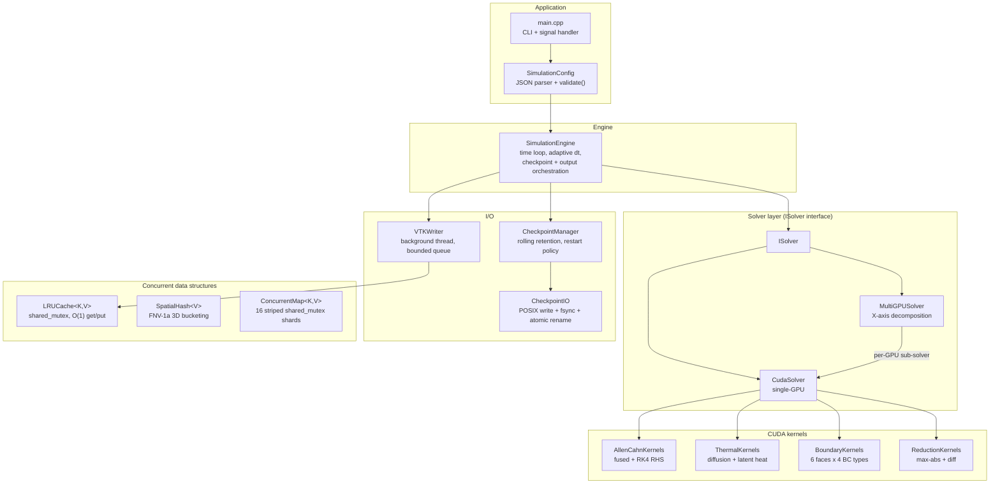
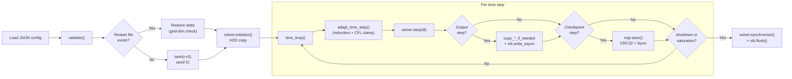
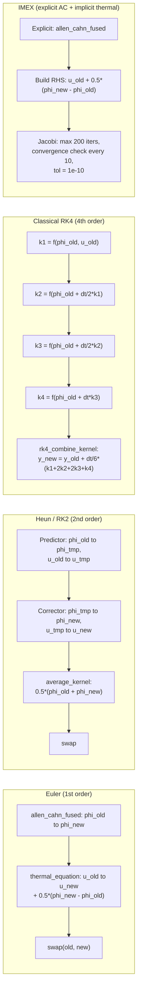
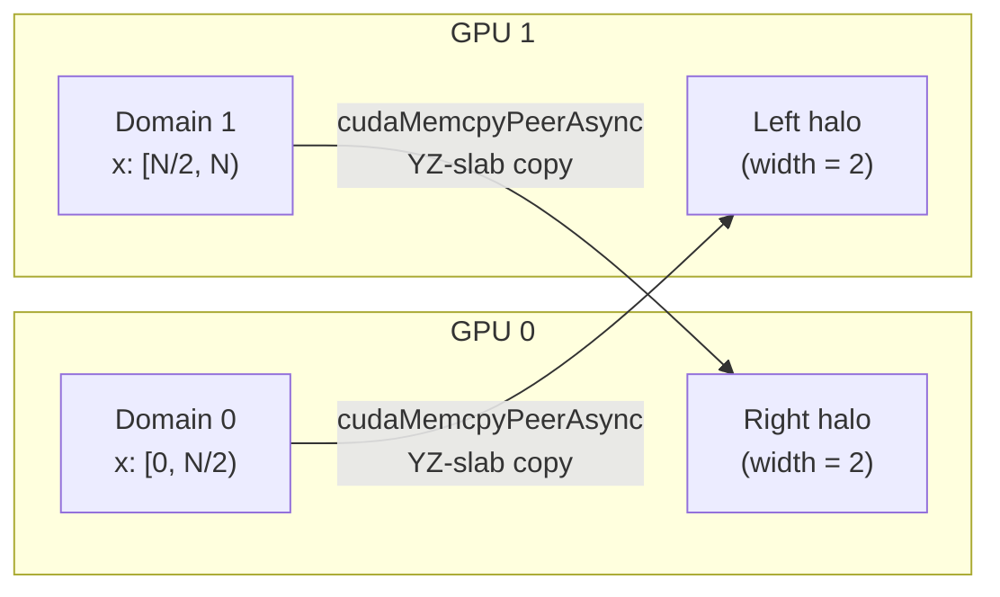

# Allen-Cahn CUDA — Phase-Field Simulation of Dendritic Solidification

Production-grade GPU-accelerated 3D phase-field simulation of dendritic crystal growth, built on the Karma–Rappel thin-interface formulation of the coupled Allen–Cahn and thermal-diffusion equations.

Built with C++23, CUDA 12+, VTK 9, and CMake 3.28+. Designed for production environments handling complex solidification problems without numerical simplification.

---

## Table of Contents

- [Features](#features)
- [Architecture Overview](#architecture-overview)
- [Simulation Data Flow](#simulation-data-flow)
- [Time Integration Schemes](#time-integration-schemes)
- [Multi-GPU Domain Decomposition](#multi-gpu-domain-decomposition)
- [Dependencies](#dependencies)
- [Build](#build)
- [Run](#run)
- [Visualization](#visualization)
- [Configuration](#configuration)
- [GPU Memory Budget](#gpu-memory-budget-600-grid)
- [Docker](#docker)
- [Kubernetes](#kubernetes)
- [Testing](#testing)
- [Project Structure](#project-structure)
- [Documentation](#documentation)
- [References](#references)

---

## Features

- **Modern C++23 / CUDA 20** with RAII, move semantics, and no raw owning pointers.
- **Four time integrators**: Forward Euler, Heun (RK2), classical RK4, and IMEX (explicit Allen–Cahn + implicit thermal via Jacobi).
- **Kernel fusion**: a single-pass Allen–Cahn kernel computes anisotropic force, divergence, and update without any intermediate `Fx`/`Fy`/`Fz` global arrays.
- **O(1) field swap**: pointer swap (`std::swap` of `DeviceField` handles) replaces O(N) data-copy kernels at the end of each step.
- **Multi-GPU support**: X-axis domain decomposition with `cudaMemcpyPeerAsync` halo exchange (halo width = 2 to match the fused kernel's effective stencil reach).
- **Anisotropic solidification**: cubic anisotropy A(n) with 4-fold crystal symmetry, including the corrected isotropic spherical-average fallback `1 − 3ε/5` when the gradient vanishes.
- **Two Laplacian stencils**: standard 7-point and isotropic 27-point (Patra–Karttunen weights `14·face + 3·edge + 1·corner − 128·center`, divisor `30·h²`).
- **Per-face boundary conditions**: independent Dirichlet / Neumann / Periodic / Robin on each of the 6 faces (`x_lo`, `x_hi`, `y_lo`, `y_hi`, `z_lo`, `z_hi`).
- **Adaptive time stepping**: CFL-bounded with target-tolerance control via parallel reduction.
- **Async I/O**: dedicated VTK/raw writer thread with bounded job queue, `condition_variable` backpressure, atomic temp-then-rename writes, and an LRU-cached field-statistics map.
- **Crash-safe binary checkpointing**: 128-byte fixed header with magic `ACCHKPT`, CRC32 over field data, atomic rename + parent-directory `fsync`, and rolling retention.
- **Saturation guard**: O(N²) boundary-only reduction triggers clean shutdown when the dendrite reaches a wall, before the near-boundary force-divergence bias destabilises the integrator.
- **Thread-safe data structures**: striped concurrent map (16 shards), LRU cache (`std::shared_mutex`), spatial hash (FNV-1a 3D bucketing).
- **Comprehensive test suite**: 21 unit-test files and 7 integration-test files; mathematical correctness checked against analytic solutions (Laplacian on quadratic fields, anisotropy along axes/diagonals, etc.).
- **Docker infrastructure**: multi-stage `dev` / `test` / `prod` images plus a one-shot `cuda-dev` image for the `make cuda-*` workflow.
- **Kubernetes orchestration**: batch-Job manifests with non-root pod security context, RBAC (ServiceAccount + Role + RoleBinding), NetworkPolicy (deny-ingress + DNS-only egress), CUDA-driver init container, and Kustomize overlays for `dev` and `prod` namespaces.
- **CI/CD**: GitHub Actions matrix for Debug/Release, clang-format and clang-tidy gates, K8s manifest validation via `kubeconform` (offline), Docker multi-target build, and self-hosted GPU runner job.

---

## Architecture Overview



## Simulation Data Flow



## Time Integration Schemes



## Multi-GPU Domain Decomposition



Halo width is 2 because the fused Allen–Cahn kernel computes the force divergence by re-evaluating the force at the ±1 neighbours, and each neighbour-force itself needs a ±1 gradient — so the effective read reach from any thread is ±2 cells. Inter-GPU sub-domain X faces are configured as Neumann (zero-flux) by `MultiGPUSolver`; the halo exchange supplies the real values, so this is benign and avoids the wrong global BC being applied at internal interfaces.

---

## Dependencies

| Dependency       | Version       | Required | Notes                                  |
|------------------|---------------|----------|----------------------------------------|
| CMake            | ≥ 3.28        | Yes      | Native CUDA language support           |
| CUDA Toolkit     | ≥ 12.0        | Yes      | CUDA C++20 device code                 |
| GCC / Clang      | C++23-capable | Yes      | GCC 13+ recommended                    |
| `nlohmann_json`  | ≥ 3.11        | Auto     | `FetchContent` (URL tarball)           |
| `spdlog`         | ≥ 1.12        | Auto     | `FetchContent` (URL tarball)           |
| GoogleTest       | ≥ 1.14        | Auto     | `FetchContent` (tests only)            |
| VTK              | ≥ 9.0         | Optional | Required for `.vts` output             |
| HDF5             | any           | Optional | Optional checkpoint backend            |

---

## Build

```bash
git clone https://github.com/myousefi2016/Allen-Cahn-CUDA.git
cd Allen-Cahn-CUDA

# Release build
cmake -S . -B build/release -G Ninja \
  -DCMAKE_BUILD_TYPE=Release \
  -DCMAKE_CUDA_ARCHITECTURES=native
cmake --build build/release -j

# Debug build with tests
cmake -S . -B build/debug -G Ninja \
  -DCMAKE_BUILD_TYPE=Debug \
  -DAC_BUILD_TESTS=ON
cmake --build build/debug -j
ctest --test-dir build/debug --output-on-failure
```

CMake presets are also available (see `CMakePresets.json`):

```bash
cmake --preset release
cmake --build build/release -j

cmake --preset debug
cmake --build build/debug -j
```

---

## Run

Native binary (after a build):

```bash
./build/release/src/allen-cahn-cuda                        # uses config/default.json (if present)
./build/release/src/allen-cahn-cuda config/run_dendrite.json
./build/release/src/allen-cahn-cuda config/benchmark_small.json
```

Or use the `Makefile` — it wraps build, test, and run for both the native CMake-preset workflow and the containerized CUDA workflow. See `make help` for the full list.

```bash
# Native (host has cmake + nvcc)
make build                       # Release build via CMake preset
make test                        # Build debug + run ctest
make run CONFIG=config/benchmark_small.json

# Any docker host with nvidia-container-toolkit
make cuda-image                  # one-time: build prebuilt dev image (~1-2 min)
make cuda-build                  # configure + build inside the prebuilt image
make cuda-test                   # full unit + integration suite
make cuda-test-unit              # unit tests only
make cuda-test-integration       # integration tests only
make cuda-run-small              # 128^3 quick benchmark      -> ./out (raw)
make cuda-run-vtk                # 128^3 dendrite             -> ./out (.vts for ParaView)
make cuda-run-dendrite           # 160^3 dendrite (Heun, 27pt, eps=0.12) -> ./out (.vts)
make cuda-run-dendrite-large     # 384^3 dendrite (~16 min on T4)
make cuda-run-dendrite-long      # 192^3 long ~5 hour run with crash-safe checkpointing
make cuda-resume-dendrite        # resume the long run from latest intact checkpoint
make cuda-resume-dendrite-large  # resume the large run
make cuda-status-dendrite        # show progress: latest checkpoint, frame count, % done
make cuda-watch-dendrite         # tail run_long.log
make cuda-run-default            # 600^3 production run        -> ./out (.vts)
make cuda-run CONFIG=config/my.json  # arbitrary config
make cuda-visualize              # render ./out/*.vts -> ./viz/*.png + dendrite.mp4 (panels)
make cuda-visualize-single       # 3D cutaway view only, no sidebar
make cuda-visualize-self-test    # synthetic-data smoke test of the visualizer
make cuda-dendrite-demo          # build + run-dendrite + visualize end-to-end
make cuda-shell                  # interactive shell in the CUDA container
make cuda-all                    # build + test + run-vtk + visualize end-to-end
make cuda-clean                  # wipe build/, out/, checkpoints/, viz/
make cuda-image-rebuild          # force-rebuild the dev image (after apt-pkg change)
```

### Long resumable run (overnight dendrite simulation)

`cuda-run-dendrite-long` runs a 192³ Allen–Cahn simulation for ~530 τ₀ on a
T4 (≈ 5 hours wall-clock). This is the time horizon needed for textbook
6-arm cubic dendrites to develop via the Mullins–Sekerka instability (per
Plapp & Karma 2003); the short `cuda-run-dendrite` only reaches ≈ 40 τ₀
which produces a faceted cube but no extended arms.

Crash safety:
- Checkpoints every 3000 steps (≈ 4 minutes of compute lost on `SIGKILL` / suspend).
- `keep_last = 3` (≈ 324 MB on disk for 192³).
- `cuda-resume-dendrite` finds the highest-numbered intact checkpoint
  (rejecting any truncated mid-write file via size validation), injects it
  into the config, and resumes the binary at the next step. If no usable
  checkpoint exists it cold-starts.

Recommended workflow (mandatory backgrounding so it survives terminal close):

```bash
# Option 1 — tmux (preferred; you can re-attach to see live progress)
tmux new -s dendrite 'make cuda-run-dendrite-long'
# Detach with Ctrl-B then D; reattach with: tmux attach -t dendrite

# Option 2 — nohup + log file
nohup make cuda-run-dendrite-long > run_long.log 2>&1 &
make cuda-watch-dendrite          # = tail -F run_long.log

# Check progress at any time
make cuda-status-dendrite

# After ANY interrupt (Ctrl-C, container kill, host suspend, OOM, ...)
make cuda-resume-dendrite         # picks up where it left off, no flags needed

# Visualize partial / completed output (works mid-run too)
make cuda-visualize VIZ_EXTRA_ARGS="--skip-saturated"
```

The resume mechanism is implemented in `scripts/resume_from_latest_checkpoint.py`,
which is idempotent and safe to invoke repeatedly.

Override defaults on the command line:

```bash
make cuda-build CUDA_ARCH=80     # A100 instead of T4
make cuda-run CONFIG=config/default.json OUT_DIR=/data/out
```

---

## Visualization

`scripts/visualize_dendrite.py` is a production-quality PyVista tool that
renders the `.vts` snapshots produced by `cuda-run-vtk` /
`cuda-run-dendrite` / `cuda-run-default` into PNG frames plus an optional
MP4 video. It runs fully **headless** (no X server) via
`pv.start_xvfb()` and is baked into the `cuda-dev` Docker image, so no
host Python install is needed.

### Anti-speckle rendering pipeline

The default output uses several techniques to avoid the moiré / dotted-grid
artifacts that a naïve `contour() + slice_orthogonal(opacity=0.85)` recipe
produces in late frames:

1. **Opaque cutaway slices** on the three back walls of the bounding box
   instead of three semi-transparent mid-plane slices — eliminates the
   alpha-blending speckle that appears when the dendrite reaches the box.
2. **Taubin smoothing** of the marching-cubes mesh (`--smooth-iters`,
   default 20). Shape-preserving (unlike Laplacian), so dendrite tips
   stay sharp while grid-aligned vertex noise is removed.
3. **SSAA + 8× MSAA** + low specular on the iso surface — kills
   grid-frequency specular aliasing.
4. **Silhouette outline** on the iso surface — clean reading edge against
   any background.
5. **Three-light rig** + soft gradient background (steel-blue → near-white)
   for proper 3D depth cues.

### Layouts

| Layout              | What you see | Best for |
|---------------------|--------------|----------|
| `panels` (default)  | 1920×1080 composite: cutaway 3D (left), `phi` mid-z slice (top right), `u` mid-z slice (bottom right), time-series sidebar with solid fraction & ⟨u⟩ + saturation shading | publication / animation frames |
| `single`            | only the 3D cutaway view at the requested window size | quick previews, small files |

### Saturation guard

When the dendrite reaches a wall (`phi > -0.5` anywhere on the boundary
slab) the frame carries no useful morphology. By default these frames are
rendered with a red **SATURATED — wall reached** badge in the upper-right.
`--skip-saturated` (or `make cuda-dendrite-demo`, which sets it) drops
them entirely.

### End-to-end demo (recommended)

```bash
make cuda-image                # one-time, ~3 min
make cuda-dendrite-demo        # build + 160^3 dendrite run + production viz
                               # ≈ 3-5 min total on a T4
```

Output:

```
viz/
  frame_000000.png    # step 0
  frame_000060.png    # step 60
  ...
  dendrite.mp4        # stitched video
```

### Common overrides

```bash
# Higher resolution, 24 fps
make cuda-visualize VIZ_WINDOW_W=2560 VIZ_WINDOW_H=1440 VIZ_FPS=24

# Just the 3D cutaway, no sidebar
make cuda-visualize-single

# Different output directories
make cuda-visualize VIZ_IN=/data/run42 VIZ_OUT=/data/run42/viz

# Drop saturated frames; cap at 30 frames; no silhouette outline
make cuda-visualize VIZ_EXTRA_ARGS="--skip-saturated --limit 30 --no-silhouette"

# Aggressive smoothing for very noisy iso surfaces (dx >> typical)
make cuda-visualize VIZ_SMOOTH_ITERS=40 VIZ_PASS_BAND=0.05

# Different colormap pair
make cuda-visualize VIZ_PHI_CMAP=RdBu_r VIZ_U_CMAP=inferno
```

### Verifying the visualizer (CI-friendly)

The visualizer ships a smoke test that synthesizes a 24³ structured grid
and exercises every code path (prescan, render, saturation guard,
scan-JSON dump, MP4 stitching). Runs in < 10 s with no GPU and no real
`.vts` data:

```bash
make cuda-visualize-self-test     # in-image smoke test
# OR directly:
python3 scripts/visualize_dendrite.py --self-test
python3 tests/visualize_smoke.py
```

### Direct CLI

```bash
docker run --rm -v $PWD:/work -w /work allen-cahn-cuda-dev:local \
  python3 scripts/visualize_dendrite.py \
    --input-dir ./out --output-dir ./viz \
    --layout panels --make-video --fps 15 \
    --phi-cmap coolwarm --u-cmap plasma \
    --smooth-iters 20 --pass-band 0.10 \
    --window-size 1920 1080 \
    --skip-saturated \
    --scan-json ./viz/scan.json
```

Full CLI: `python3 scripts/visualize_dendrite.py --help`.

---

## Configuration

All parameters are specified in JSON. See `config/default.json` for defaults
and `config/run_dendrite*.json` for dendrite-friendly presets.

```json
{
    "physics":  { "delta": 0.8, "epsilon": 0.07, "W0": 1.0, "beta0": 0.0, "D": 2.0, "d0": 0.5 },
    "grid":     { "Nx": 600, "Ny": 600, "Nz": 600, "dx": 0.4, "dy": 0.4, "dz": 0.4 },
    "time":     { "dt": 0.01, "max_steps": 6000, "scheme": "euler", "adaptive": false, "cfl_safety": 0.9 },
    "stencil":  "7pt",
    "output":   { "frequency": 100, "output_dir": "./out", "format": "vts", "async_io": true },
    "checkpoint": { "frequency": 500, "checkpoint_dir": "./checkpoints", "keep_last": 3 },
    "gpu":      { "device_ids": [0], "block_size": 256, "multi_gpu": false },
    "initial":  { "seed_radius": 6.0 },
    "boundary": {
        "phi": { "type": "dirichlet", "value": -1.0 },
        "u":   { "type": "dirichlet", "value": -0.8 }
    }
}
```

### Available options

| Parameter             | Accepted values |
|-----------------------|-----------------|
| `time.scheme`         | `"euler"`, `"heun"`, `"rk4"`, `"imex"` |
| `stencil`             | `"7pt"` / `"standard"`, `"27pt"` / `"isotropic"` (Patra–Karttunen) |
| `boundary.*.type`     | `"dirichlet"`, `"neumann"`, `"periodic"`, `"robin"` |
| `output.format`       | `"vts"` (VTK structured grid), `"raw"` (binary) |
| `gpu.block_size`      | multiple of 32 in `[32, 1024]` |

### Per-face boundary conditions

Each field can have independent BCs on each of the 6 faces:

```json
{
    "boundary": {
        "phi": {
            "x_lo": { "type": "neumann",   "flux": 0.0 },
            "x_hi": { "type": "dirichlet", "value": -1.0 },
            "y_lo": { "type": "periodic" },
            "y_hi": { "type": "periodic" },
            "z_lo": { "type": "robin", "alpha": 1.0, "beta": 0.5, "gamma": 0.0 },
            "z_hi": { "type": "neumann", "flux": 0.0 }
        }
    }
}
```

---

## GPU memory budget (600³ grid)

For 600³ = 2.16 × 10⁸ cells × 8 bytes per double = 1.6875 GB per field.
The fused Allen–Cahn kernel removes the three force arrays (`Fx`, `Fy`,
`Fz`) and any precomputed index arrays — they are recomputed on the fly
inside the kernel.

| Component                              | Original code               | Optimized                          | Savings |
|----------------------------------------|-----------------------------|------------------------------------|---------|
| `IDx`, `IDy`, `IDz` (index arrays)     | ~5.0 GB                     | 0 GB (computed from thread ID)     | 100%    |
| `Fx`, `Fy`, `Fz` (force arrays)        | ~5.0 GB                     | 0 GB (fused-kernel recomputation)  | 100%    |
| `phi_old`, `phi_new`, `u_old`, `u_new` | ~6.75 GB                    | ~6.75 GB                           | —       |
| Field swap                             | O(N) `cudaMemcpyAsync`      | O(1) pointer swap                  | ~100%   |
| **Total (Euler)**                      | **~17 GB**                  | **~6.75 GB**                       | **~60%** |

For RK4 add `phi_tmp`, `u_tmp`, four `k*_phi`, four `k*_u`, plus three
force arrays — total about 28 GB, which exceeds 16 GB-class GPUs (e.g.
T4); use 384³ or smaller for RK4 on those devices.

---

## Docker

```bash
# Development environment (mounts source, ccache)
docker compose --profile dev up

# Run the test suite
docker compose --profile test up

# Production simulation (provide config)
docker compose --profile prod run prod config/default.json
```

| File                          | Purpose                                                                                |
|-------------------------------|----------------------------------------------------------------------------------------|
| `docker/Dockerfile.dev`       | Full CUDA 12.6 development environment, non-root user, source mount expected           |
| `docker/Dockerfile.prod`      | Multi-stage builder + minimal runtime (non-root)                                       |
| `docker/Dockerfile.test`      | Builds debug, runs `ctest` as entrypoint                                                |
| `docker/Dockerfile.cuda-dev`  | Prebuilt dev image used by the `make cuda-*` targets (saves apt-install per invocation) |
| `docker-compose.yml`          | Profiles: `dev`, `test`, `prod` (image tag `allencahn-cuda:<profile>`)                  |

The `make cuda-*` targets use `allen-cahn-cuda-dev:local` (the
`Dockerfile.cuda-dev` image), built once via `make cuda-image`.

---

## Kubernetes

This project deploys as a batch **Job** (the simulation is a finite,
checkpointable computation, not a long-lived service).

```bash
# Deploy to development namespace
kubectl apply -k k8s/overlays/dev/

# Deploy to production namespace
kubectl apply -k k8s/overlays/prod/

# Monitor
kubectl -n allen-cahn-prod get pods
kubectl -n allen-cahn-prod logs -f job/prod-allen-cahn-simulation
```

Manifests in `k8s/base/`:

| File                  | Purpose                                                                                       |
|-----------------------|-----------------------------------------------------------------------------------------------|
| `configmap.yaml`      | Embedded JSON simulation config (`/config/simulation.json`)                                   |
| `pvc.yaml`            | `ReadWriteOnce` PVC for output + checkpoints                                                  |
| `rbac.yaml`           | `ServiceAccount` + minimal `Role` + `RoleBinding`                                             |
| `networkpolicy.yaml`  | Deny all ingress; egress restricted to DNS                                                     |
| `job.yaml`            | The `Job` itself: GPU resource request, init container running `nvidia-smi`, non-root pod, `readOnlyRootFilesystem`, dropped capabilities, 300 s grace period |

Per-environment overlays in `k8s/overlays/{dev,prod}/` add the namespace and
patch resources / activeDeadlineSeconds / PVC size / config payload.

CI validates these manifests offline via `kubeconform` (no API server
required) — see `.github/workflows/ci.yml`.

---

## Testing

The suite is split into two `ctest` executables — `unit_tests` and
`integration_tests` — and is verified on an NVIDIA T4 (compute 7.5)
inside an `nvidia/cuda:12.6.0-devel-ubuntu24.04` container.

| Suite             | Files | Status            |
|-------------------|-------|-------------------|
| Unit tests        | 21    | ✅ all passing     |
| Integration tests | 7     | ✅ all passing     |

```bash
git clone https://github.com/myousefi2016/Allen-Cahn-CUDA.git
cd Allen-Cahn-CUDA
git checkout feature/production-cuda-rewrite

docker run --rm --gpus all -v $PWD:/work -w /work \
  nvidia/cuda:12.6.0-devel-ubuntu24.04 bash -c '
    apt-get update && apt-get install -y --no-install-recommends \
      cmake ninja-build gcc-13 g++-13 git pkg-config \
      libvtk9-dev libhdf5-dev ca-certificates &&
    update-alternatives --install /usr/bin/gcc gcc /usr/bin/gcc-13 100 &&
    update-alternatives --install /usr/bin/g++ g++ /usr/bin/g++-13 100 &&
    cmake -B build -G Ninja -DCMAKE_BUILD_TYPE=Release \
      -DCMAKE_CUDA_ARCHITECTURES=75 -DAC_BUILD_TESTS=ON &&
    cmake --build build -j$(nproc) &&
    ctest --test-dir build --output-on-failure -j$(nproc)
  '
```

### Unit tests (`tests/unit/`, 21 files)

| File                          | What it covers                                                                  |
|-------------------------------|----------------------------------------------------------------------------------|
| `test_Grid.cpp`               | Grid construction, indexing, spacing, validity checks                            |
| `test_GridValidation.cu`      | Configuration-time grid validation                                               |
| `test_SimulationConfig.cpp`   | JSON config parsing, validation, defaults, derived quantities                    |
| `test_FieldData.cpp`          | Host field allocation, accessors, copies, layout invariants                      |
| `test_InitialCondition.cu`    | tanh seed profile correctness, centre/corner sentinels                           |
| `test_CheckpointIO.cpp`       | Binary checkpoint serialize/deserialize round-trip, CRC32                        |
| `test_CheckpointManager.cpp`  | Frequency, rolling retention, restart-from-latest                                |
| `test_LRUCache.cpp`           | LRU eviction order, capacity, hit/miss, concurrent access                        |
| `test_SpatialHash.cpp`        | 3D bucket insert/query, FNV-1a hashing                                           |
| `test_ConcurrentMap.cpp`      | Striped concurrent map operations under contention                               |
| `test_Logger.cpp`             | spdlog init idempotency, level changes                                           |
| `test_DeviceField.cu`         | RAII allocation, async H2D/D2H, swap, large allocs                               |
| `test_Laplacian.cu`           | 7- and 27-point isotropic Laplacian on analytic quadratic / linear / constant fields |
| `test_Gradient.cu`            | 2nd- and 4th-order central-difference gradient kernels                           |
| `test_Anisotropy.cu`          | A(n) along axes / diagonal / zero-gradient fallback, dFunc, dF/dphi              |
| `test_BoundaryConditions.cu`  | Dirichlet, Neumann, Periodic, Robin, per-face mixed, interior unchanged          |
| `test_Reduction.cu`           | Block-strided max-abs and max-abs-diff reductions                                |
| `test_ThermalKernels.cu`      | Thermal diffusion + latent-heat coupling                                         |
| `test_CudaSolver.cu`          | Solver lifecycle, all 4 time schemes, per-face BC end-to-end                     |
| `test_SimulationEngine.cu`    | Engine init, IC, adaptive dt, short run, saturation detection, config-validation rejection |
| `test_VTKWriter.cpp`          | Async writer queue, raw / VTS output, flush completion, statistics cache         |

### Integration tests (`tests/integration/`, 7 files)

| File                          | What it covers                                                                  |
|-------------------------------|----------------------------------------------------------------------------------|
| `test_SphereRegression.cu`    | Dendritic growth from spherical seed reproduces reference behaviour              |
| `test_EulerConvergence.cu`    | Forward Euler shows expected error reduction under dt refinement                 |
| `test_EnergyConservation.cu`  | Phase-field free-energy decreases monotonically                                  |
| `test_SchemeComparison.cu`    | Euler vs Heun vs RK4 agreement; IMEX stability at large dt                       |
| `test_CheckpointRestart.cu`   | Checkpoint at midpoint then restart matches uninterrupted run                    |
| `test_StencilComparison.cu`   | 7-point vs 27-point: bounded fields, smoother 27-pt interface, same physics      |
| `test_AnisotropyForce.cu`     | Anisotropic force divergence reproduces 4-fold symmetric tip behaviour           |

### Run a single test

```bash
ctest --test-dir build -R BoundaryConditionsTest --output-on-failure
ctest --test-dir build -R StencilComparisonTest  --output-on-failure
```

> **Note:** if you re-run after pulling new commits, delete `build/`
> first — Ninja will otherwise report `no work to do` if the cache is
> stale relative to source changes.

---

## Project Structure

```
Allen-Cahn-CUDA/
├── src/
│   ├── core/                  # Grid, SimulationConfig, FieldData,
│   │                          # CheckpointManager, LRUCache, SpatialHash, ConcurrentMap
│   ├── cuda/                  # ISolver, CudaSolver, MultiGPUSolver,
│   │                          # AllenCahn / Thermal / Boundary / Reduction kernels,
│   │                          # DeviceField (RAII GPU memory), CudaUtils (Stream, Event)
│   ├── io/                    # VTKWriter (async), CheckpointIO (binary, fsync, CRC32)
│   ├── logging/               # Logger (spdlog wrapper)
│   ├── main.cpp               # Entry point + signal handler
│   └── CMakeLists.txt
├── tests/
│   ├── unit/                  # 21 unit-test files
│   ├── integration/           # 7 integration-test files
│   ├── visualize_smoke.py     # PyVista visualizer self-test
│   └── CMakeLists.txt
├── config/                    # JSON simulation configs (default, dendrite, etc.)
├── docker/                    # Dockerfile.dev, .test, .prod, .cuda-dev
├── docker-compose.yml         # dev / test / prod profiles
├── k8s/
│   ├── base/                  # configmap, pvc, rbac, networkpolicy, job, kustomization
│   └── overlays/{dev,prod}/   # namespace + per-env patches + kustomization
├── scripts/                   # visualize_dendrite.py, resume_from_latest_checkpoint.py
├── docs/                      # ARCHITECTURE.md, DESIGN.md, THEORY.md
├── cmake/                     # Dependencies.cmake, CompilerWarnings.cmake, CUDAConfig.cmake
├── .github/                   # workflows/ci.yml, ISSUE_TEMPLATE/, PULL_REQUEST_TEMPLATE.md
├── CMakeLists.txt
├── CMakePresets.json
├── Makefile
└── README.md
```

---

## Documentation

- [Architecture Guide](docs/ARCHITECTURE.md) — system design, module dependencies, threading model, halo-exchange protocol.
- [Design Document](docs/DESIGN.md) — algorithm details, data structures, numerical schemes, multi-GPU strategy.
- [Theory Document](docs/THEORY.md) — phase-field PDEs, Karma–Rappel formulation, anisotropy, stencils, time integrators.

---

## References

1. Karma, A., & Rappel, W.-J. (1998). Quantitative phase-field modeling of dendritic growth in two and three dimensions. *Physical Review E*, **57**(4), 4323.
2. Plapp, M., & Karma, A. (2003). Multiscale finite-difference–diffusion–Monte-Carlo method for simulating dendritic solidification. *Journal of Computational Physics*, **165**(2), 592–619.
3. Patra, M., & Karttunen, M. (2006). Stencils with isotropic discretization error for differential operators. *Numerical Methods for Partial Differential Equations*, **22**(4), 936–953.
4. Provatas, N., Goldenfeld, N., & Dantzig, J. (1998). Efficient computation of dendritic microstructures using adaptive mesh refinement. *Physical Review Letters*, **80**(15), 3308.

---

## License

See [LICENSE](LICENSE) for details.
