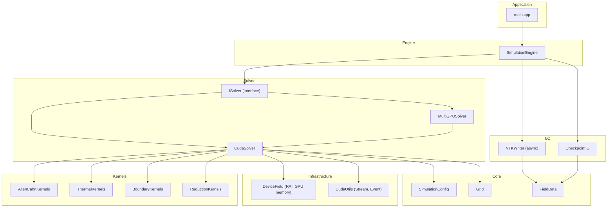
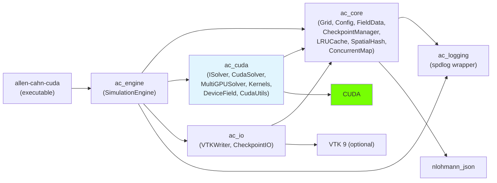
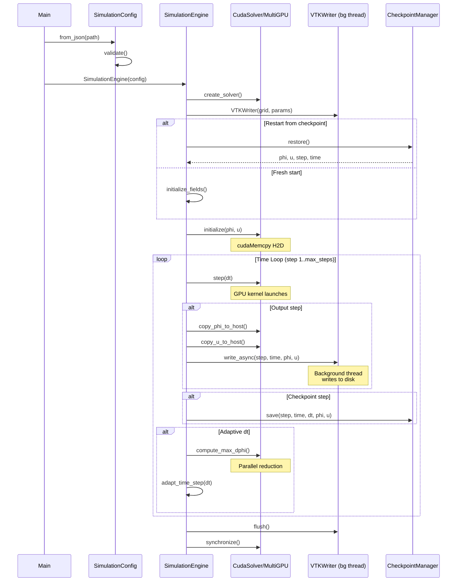
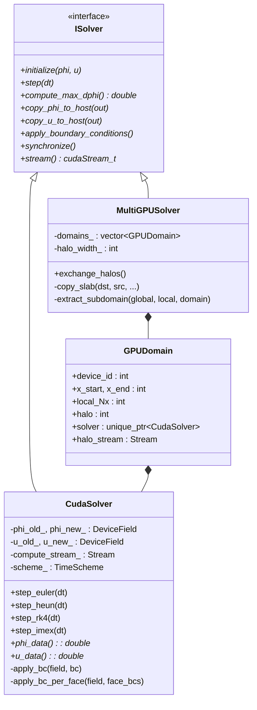
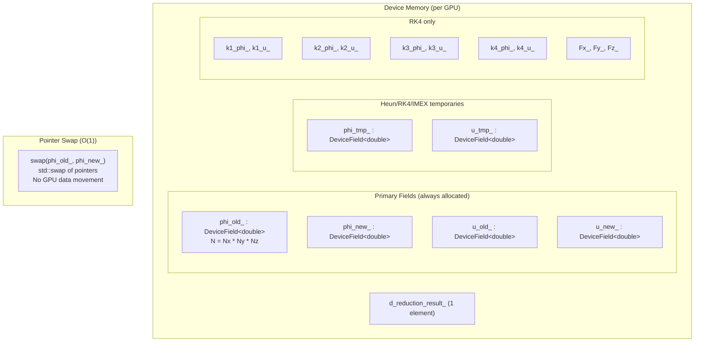
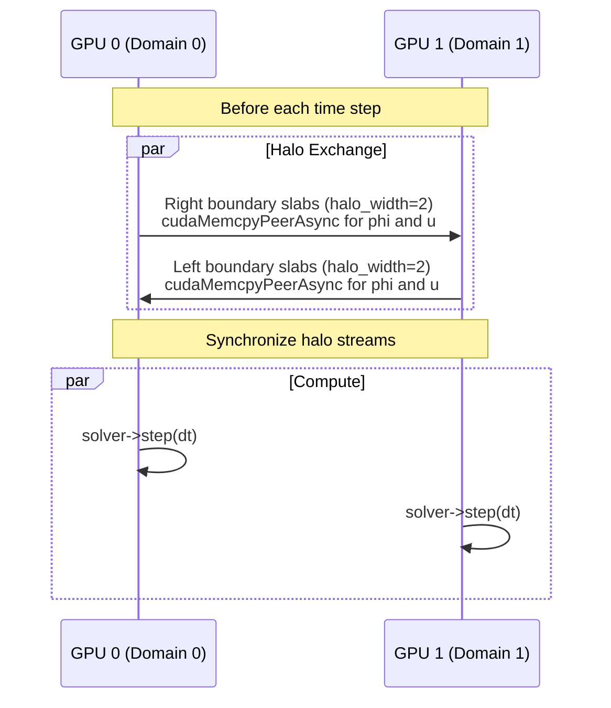
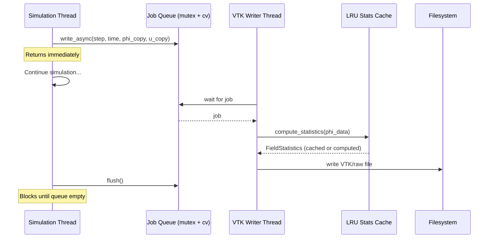
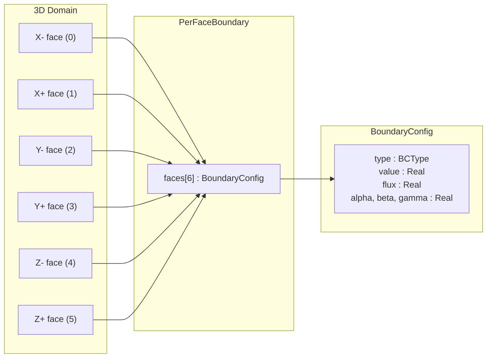
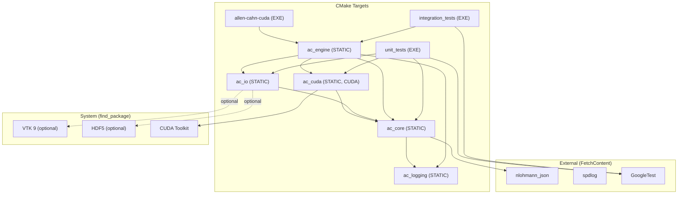

# Architecture Guide

## System Overview

Allen-Cahn CUDA is a GPU-accelerated 3D phase-field simulation implementing the coupled Allen-Cahn and thermal diffusion equations for dendritic solidification. The system is organized into layered libraries with clear separation of concerns.

## Layer Architecture

## Module Dependency Graph

## Simulation Lifecycle

## Solver Class Hierarchy

## GPU Memory Layout

## Multi-GPU Halo Exchange

## Async I/O Pipeline

## Per-Face Boundary Condition System

Each face is applied via a 2D kernel launch covering the face's surface. The kernel receives the face-specific BC parameters and applies Dirichlet, Neumann, Periodic, or Robin conditions.

## Thread Safety Model

| Component | Synchronization | Access Pattern |
|-----------|----------------|----------------|
| `LRUCache` | `std::shared_mutex` | Shared reads, exclusive writes |
| `ConcurrentMap` | 16 `std::shared_mutex` stripes | Distributed lock contention |
| `SpatialHash` | None (build-then-query) | Single-threaded build, read-only queries |
| `VTKWriter` | `std::mutex` + `condition_variable` | Producer-consumer queue |
| `DeviceField` | None (single-stream) | One CUDA stream per solver |
| `MultiGPUSolver` | Per-GPU streams, sync barriers | Parallel compute, synchronized halo exchange |

## Build System

