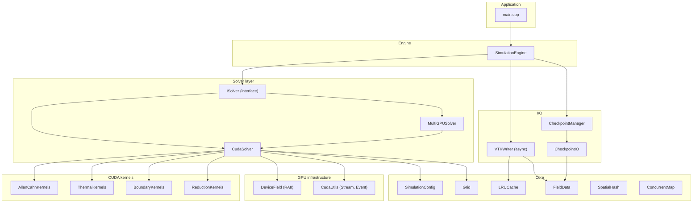
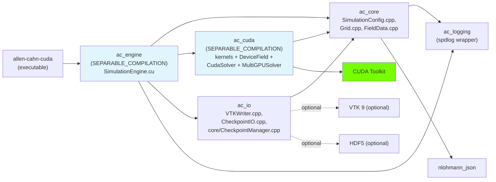
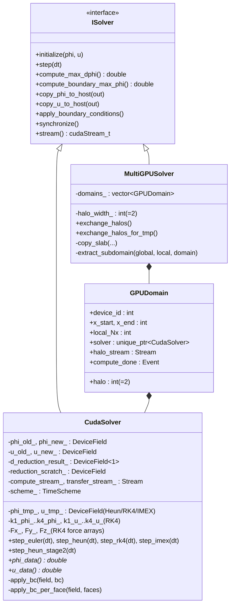
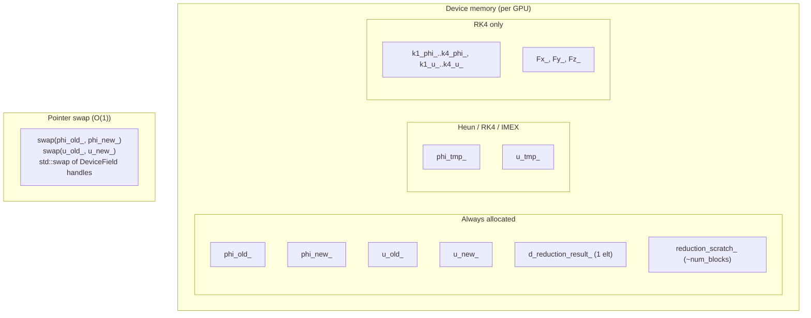
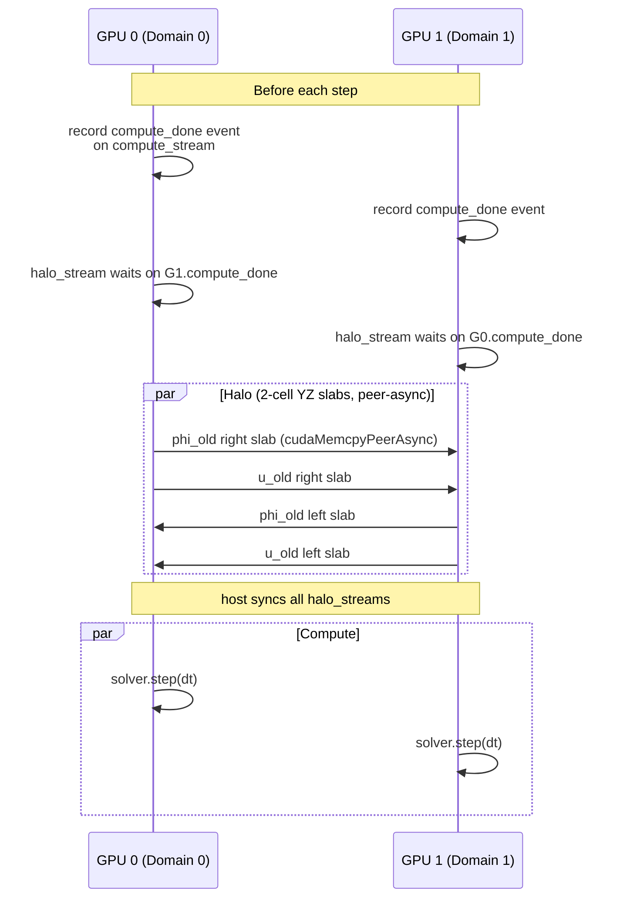
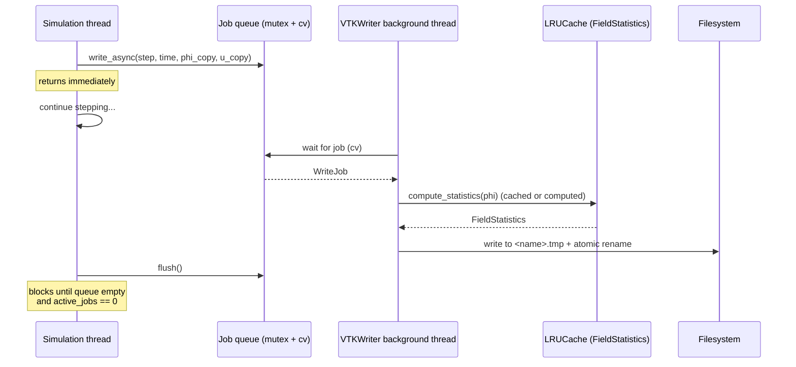
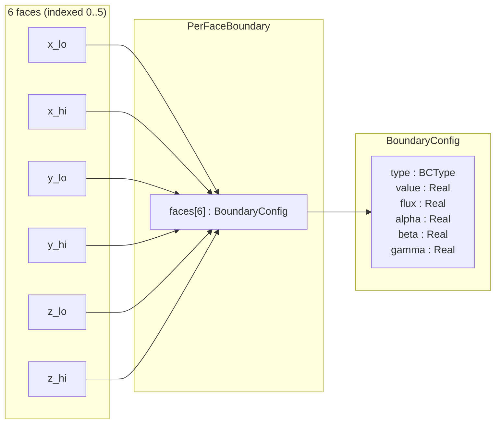
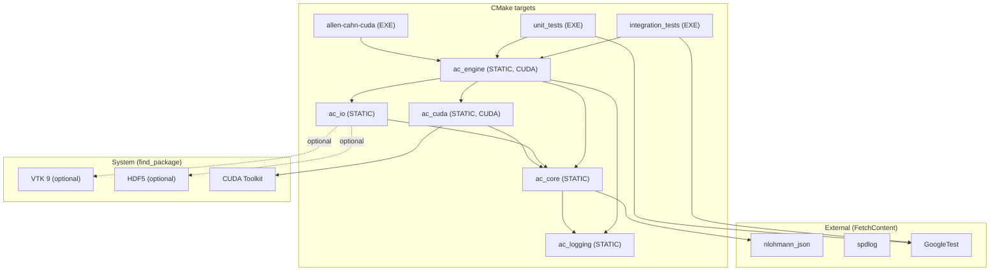

# Architecture Guide

This document describes the high-level architecture of Allen-Cahn-CUDA:
how the source tree is organised into layered libraries, how the runtime
components interact, and what the threading and memory model look like.
Every claim cites the source file and line where the corresponding code
lives.

---

## 1. System Overview

Allen-Cahn-CUDA is a GPU-accelerated 3D phase-field simulation
implementing the coupled Allen–Cahn and thermal-diffusion equations
(Karma–Rappel formulation) for dendritic solidification. The system is
organised into layered libraries with strict dependency direction:
upstream layers never include downstream ones.



---

## 2. Module / Library Decomposition

The project is split into five static libraries plus the executable and
two test executables (`src/CMakeLists.txt`).



A few non-obvious facts about the build graph:

- **`ac_core` is intentionally minimal.** It only compiles
  `SimulationConfig.cpp`, `Grid.cpp`, and `FieldData.cpp`
  (`src/CMakeLists.txt:9-13`). `LRUCache`, `SpatialHash`, and
  `ConcurrentMap` are header-only utilities included by downstream
  libraries; they have no `.cpp`.
- **`CheckpointManager.cpp` lives under `src/core/` but compiles into
  `ac_io`** (`src/CMakeLists.txt:40-44`). It is grouped there because
  `CheckpointManager.hpp` includes `io/CheckpointIO.hpp`, so the only
  acyclic placement is in the I/O library that already depends on core.
- **CUDA separable compilation** is enabled on `ac_cuda` and `ac_engine`
  so that device-side functions can call across translation units.

---

## 3. Simulation Lifecycle

```mermaid
sequenceDiagram
    participant Main
    participant Cfg as SimulationConfig
    participant Eng as SimulationEngine
    participant Sol as CudaSolver / MultiGPUSolver
    participant Mgr as CheckpointManager
    participant VTK as VTKWriter (bg thread)

    Main->>Cfg: from_json(path) or defaults
    Cfg->>Cfg: validate()
    Main->>Eng: SimulationEngine(config)
    Eng->>Sol: create_solver()
    Eng->>VTK: VTKWriter(grid, params)
    Eng->>Mgr: CheckpointManager(...)

    alt Restart from checkpoint
        Eng->>Mgr: restore()
        Mgr-->>Eng: phi, u, step, time, dt, grid
        Eng->>Eng: validate dim match config
    else Fresh start
        Eng->>Eng: initialize_fields()<br/>(tanh seed)
    end

    Eng->>Sol: initialize(phi, u)
    Note over Sol: H2D copy + apply BC

    loop Time loop (step <= max_steps)
        Eng->>Sol: step(dt)
        Note over Sol: kernel sequence on compute_stream_
        alt Output step
            Eng->>Sol: copy_phi_to_host(), copy_u_to_host()
            Eng->>VTK: write_async(step, time, phi, u)
        end
        alt Checkpoint step
            Eng->>Mgr: save(step, time, dt, phi, u)
        end
        alt Adaptive dt
            Eng->>Sol: compute_max_dphi()
            Eng->>Eng: adapt_time_step()
        end
        alt Saturation guard
            Eng->>Sol: compute_boundary_max_phi()
            Note over Eng: break if > saturation_threshold
        end
        alt SIGINT / SIGTERM
            Note over Eng: g_shutdown_requested set;<br/>final checkpoint + output, break
        end
    end

    Eng->>Sol: synchronize()
    Eng->>VTK: flush()
```

`run()` is the top-level method (`SimulationEngine.cu:43-71`); the time
loop itself is `time_loop()` (`SimulationEngine.cu:113-179`).

---

## 4. Solver Class Hierarchy



The interface is in `src/cuda/ISolver.cuh`; `CudaSolver` and
`MultiGPUSolver` are in `src/cuda/`. Note `step_heun_stage2(dt)` is
public on `CudaSolver` because `MultiGPUSolver` calls it directly to
inject an inter-stage halo exchange between the predictor and corrector
(`MultiGPUSolver.cu:265-273`).

---

## 5. GPU Memory Layout



Each `DeviceField<double>` is a flat allocation of
`Nx * Ny * Nz * sizeof(double)` bytes via `cudaMalloc`, with row-major
indexing `idx = x*Ny*Nz + y*Nz + z`. Allocations are sized in
`CudaSolver`'s constructor based on the active time scheme
(`CudaSolver.cu:116-156`).

---

## 6. Multi-GPU Halo Exchange



Sub-domain X faces that abut a neighbour GPU are configured as Neumann
(zero-flux); the halo exchange supplies the real data, so the BC kernel
output is overwritten before being read on the next step
(`MultiGPUSolver.cu:69-83`).

---

## 7. Async I/O Pipeline



Implementation: `src/io/VTKWriter.cpp`. The writer thread is owned by
the `VTKWriter` instance and joined in the destructor with `stop_` set
under the mutex (`VTKWriter.cpp:30-39`).

Backpressure: producers wait on `queue_cv_` when the queue depth plus
in-flight jobs would exceed `max_queue_depth_`
(`VTKWriter.cpp:48-55`).

Crash-safety: every write goes to `<file>.tmp` first and is renamed
atomically. Raw writes use POSIX `write()` with `EINTR` handling.

---

## 8. Per-Face Boundary Condition System



`AllBoundaryConfig` (in `SimulationConfig.hpp`) holds **both** a uniform
`BoundaryConfig` (`phi_bc`, `u_bc`) and a `PerFaceBoundary`
(`phi_faces`, `u_faces`); the boolean `per_face` selects which path
`CudaSolver::apply_bc_per_face` takes (`CudaSolver.cu:478-482`).

Each face is launched as a 2D kernel covering its surface; the launch
order is **Z, Y, X** so that periodic faces see the latest values
(`BoundaryKernels.cu:200-208`). Corner / edge ownership is explicit
(X owns full plane, Y excludes X-edges, Z excludes both X- and Y-edges
— `BoundaryKernels.cu:44-52`).

---

## 9. Thread Safety Model

| Component        | Synchronisation                          | Access pattern                                |
|------------------|-------------------------------------------|------------------------------------------------|
| `LRUCache`       | `std::shared_mutex`                       | Shared reads, exclusive writes                 |
| `ConcurrentMap`  | 16 striped `std::shared_mutex` shards     | Distributed contention                         |
| `SpatialHash`    | None (build-then-query)                   | Single-threaded build, read-only after         |
| `VTKWriter`      | `std::mutex` + `std::condition_variable`  | Producer-consumer with bounded queue           |
| `DeviceField`    | None (single CUDA stream per solver)      | Stream ordering provides serialisation          |
| `MultiGPUSolver` | Per-GPU streams + CUDA events              | Halo stream waits on compute event before peer copy |
| Signal handling  | `std::atomic<bool> ac::g_shutdown_requested` | `sigaction` with `SA_RESTART`               |

`g_shutdown_requested` is defined in `src/core/SimulationEngine.cu:14`
inside `namespace ac`, declared `extern` in `SimulationEngine.hpp:19`,
and signalled from `main.cpp:14-17` via a `sigaction`-installed handler.

---

## 10. Build System



Top-level options (`CMakeLists.txt`):

| Option           | Default   | Purpose                                         |
|------------------|-----------|-------------------------------------------------|
| `AC_BUILD_TESTS` | `ON`      | Build the `unit_tests` and `integration_tests` |
| `AC_CUDA_FAST_MATH` | `OFF`  | Pass `--use_fast_math` to NVCC (Release only)   |

Install rule: `install(TARGETS allen-cahn-cuda RUNTIME DESTINATION bin)`.

CMake presets (see `CMakePresets.json`):

- `release` — `Release` build into `build/release/`.
- `debug` — `Debug` build with tests enabled into `build/debug/`.
- `relwithdebinfo` — `RelWithDebInfo` for profiling.

---

## 11. CI/CD Pipeline

`/.github/workflows/ci.yml` defines six jobs:

| Job              | Runner          | What it does                                                              |
|------------------|-----------------|---------------------------------------------------------------------------|
| `format-check`   | `ubuntu-latest` | `clang-format-18 --dry-run --Werror` over `src/` and `tests/`             |
| `clang-tidy`     | CUDA dev container | Generates compile_commands and runs `clang-tidy-18` (warnings non-blocking) |
| `build-and-test` | self-hosted GPU | Matrix of Debug / Release × CUDA 12.6.0; full `ctest` run                 |
| `build-cpu-only` | `ubuntu-latest` | Build-only sanity check (no GPU tests)                                    |
| `docker-build`   | `ubuntu-latest` | Multi-target build of `dev`, `test`, `prod` Dockerfiles via Buildx        |
| `k8s-validate`   | `ubuntu-latest` | `kustomize build` + `kubeconform` (offline, no API server required)       |
| `release-docker` | `ubuntu-latest` | On `main` push only: build & push `ghcr.io/...` production image           |

The `k8s-validate` job uses `kubeconform` because `kubectl apply
--dry-run=client` always tries to contact the API server for resource
discovery, which has no destination in CI.
