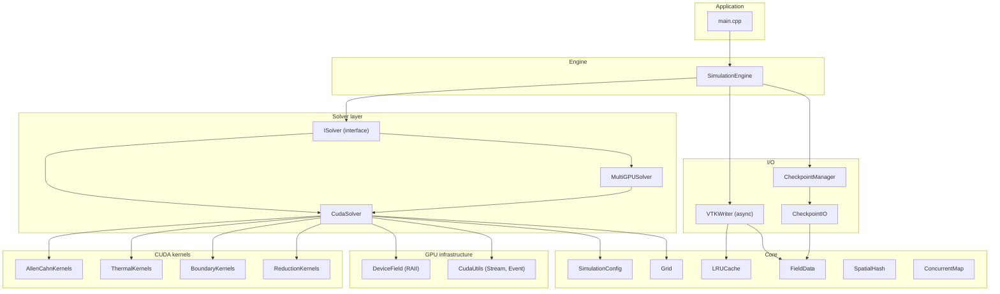
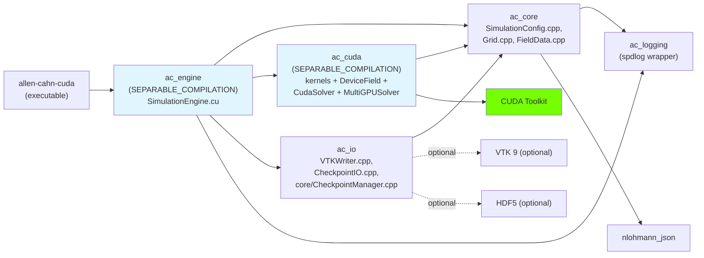
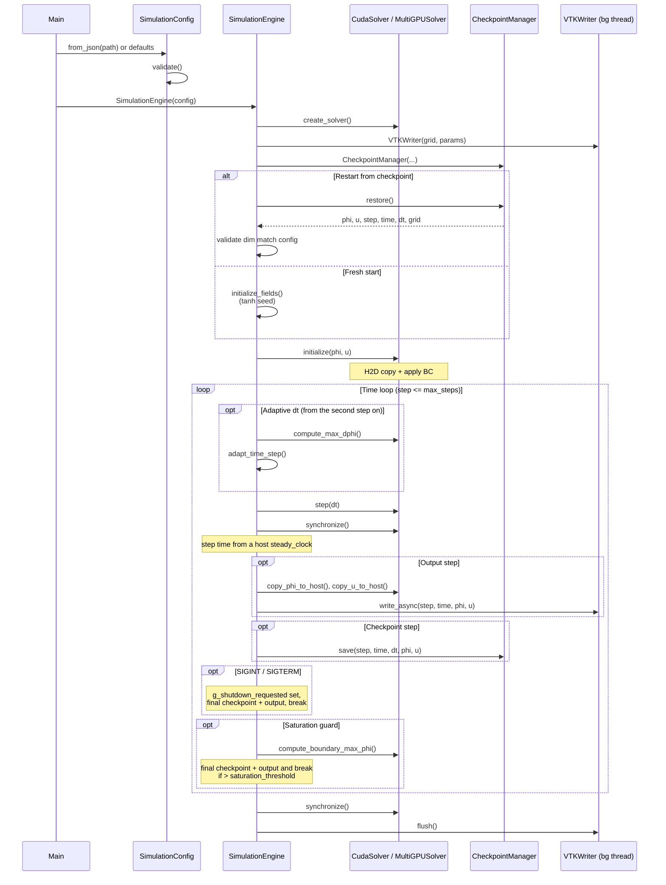
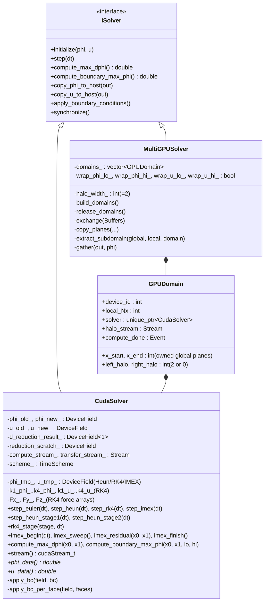
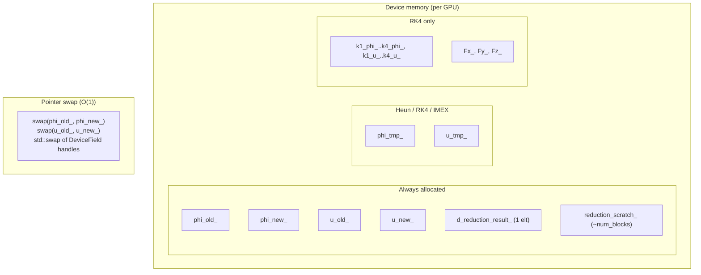
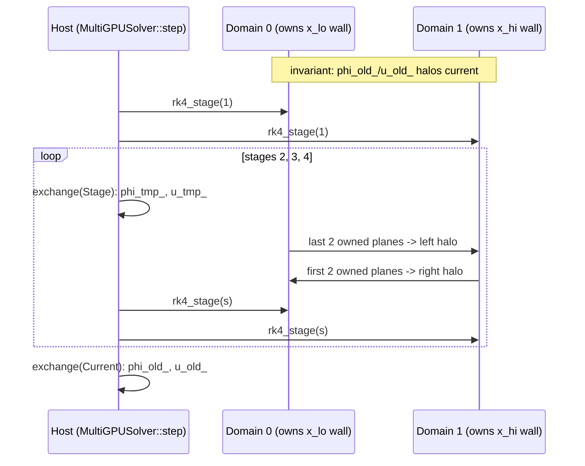
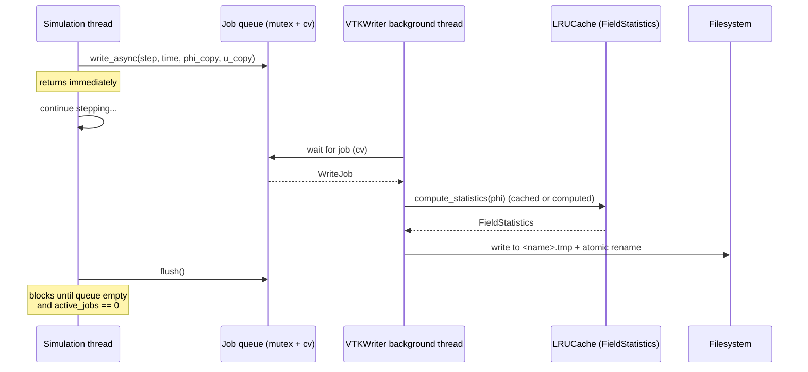
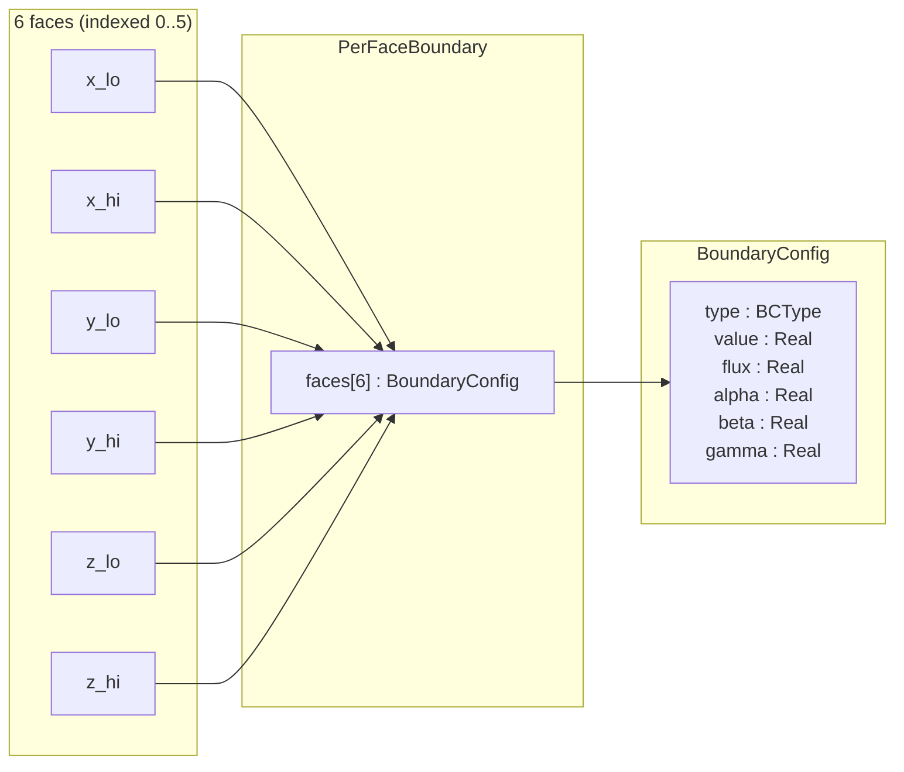
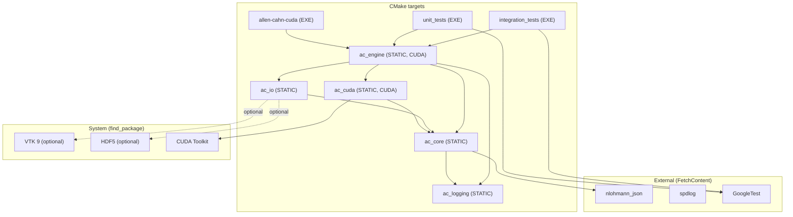

# Architecture Guide

This document describes the high-level architecture of Allen-Cahn-CUDA:
how the source tree is organised into layered libraries, how the runtime
components interact, and what the threading and memory model look like.
Every claim cites the source file and line where the corresponding code
lives.

---

## 1. System Overview

Allen-Cahn-CUDA is a GPU-accelerated 3D phase-field simulation
implementing the coupled Allen–Cahn and thermal-diffusion equations
(Karma–Rappel formulation) for dendritic solidification. The system is
organised into layered libraries with strict dependency direction:
upstream layers never include downstream ones.

```mermaid
graph TB
    subgraph App["Application"]
        Main["main.cpp"]
    end
    subgraph Engine["Engine"]
        SE["SimulationEngine"]
    end
    subgraph Solver["Solver layer"]
        IS["ISolver (interface)"]
        CS["CudaSolver"]
        MG["MultiGPUSolver"]
    end
    subgraph Kernels["CUDA kernels"]
        ACK["AllenCahnKernels"]
        TK["ThermalKernels"]
        BK["BoundaryKernels"]
        RK["ReductionKernels"]
    end
    subgraph Infra["GPU infrastructure"]
        DF["DeviceField (RAII)"]
        CU["CudaUtils (Stream, Event)"]
    end
    subgraph IO["I/O"]
        VW["VTKWriter (async)"]
        CIO["CheckpointIO"]
        CM["CheckpointManager"]
    end
    subgraph Core["Core"]
        SC["SimulationConfig"]
        GR["Grid"]
        FD["FieldData"]
        LRU["LRUCache"]
        SH["SpatialHash"]
        CMap["ConcurrentMap"]
    end

    Main --> SE
    SE --> IS
    IS --> CS
    IS --> MG
    MG --> CS
    CS --> ACK
    CS --> TK
    CS --> BK
    CS --> RK
    CS --> DF
    CS --> CU
    SE --> VW
    SE --> CM
    CM --> CIO
    VW --> LRU
    VW --> FD
    CIO --> FD
    CS --> SC
    CS --> GR
```

---

## 2. Module / Library Decomposition

The project is split into five static libraries plus the executable and
two test executables (`src/CMakeLists.txt`).

```mermaid
graph LR
    aclog["ac_logging<br/>(spdlog wrapper)"]
    accore["ac_core<br/>SimulationConfig.cpp,<br/>Grid.cpp, FieldData.cpp"]
    accuda["ac_cuda<br/>(SEPARABLE_COMPILATION)<br/>kernels + DeviceField +<br/>CudaSolver + MultiGPUSolver"]
    acio["ac_io<br/>VTKWriter.cpp,<br/>CheckpointIO.cpp,<br/>core/CheckpointManager.cpp"]
    acengine["ac_engine<br/>(SEPARABLE_COMPILATION)<br/>SimulationEngine.cu"]
    exe["allen-cahn-cuda<br/>(executable)"]
    json["nlohmann_json"]
    cuda["CUDA Toolkit"]
    vtk["VTK 9 (optional)"]
    hdf5["HDF5 (optional)"]

    accore --> aclog
    accore --> json
    accuda --> accore
    accuda --> cuda
    acio --> accore
    acio -.optional.-> vtk
    acio -.optional.-> hdf5
    acengine --> accore
    acengine --> accuda
    acengine --> acio
    acengine --> aclog
    exe --> acengine

    style accuda fill:#e1f5fe
    style acengine fill:#e1f5fe
    style cuda fill:#76ff03
```

A few non-obvious facts about the build graph:

- **`ac_core` is intentionally minimal.** It only compiles
  `SimulationConfig.cpp`, `Grid.cpp`, and `FieldData.cpp`
  (`src/CMakeLists.txt:9-13`). `LRUCache`, `SpatialHash`, and
  `ConcurrentMap` are header-only utilities included by downstream
  libraries; they have no `.cpp`.
- **`CheckpointManager.cpp` lives under `src/core/` but compiles into
  `ac_io`** (`src/CMakeLists.txt:40-44`). It is grouped there because
  `CheckpointManager.hpp` includes `io/CheckpointIO.hpp`, so the only
  acyclic placement is in the I/O library that already depends on core.
- **CUDA separable compilation** is enabled on `ac_cuda` and `ac_engine`
  so that device-side functions can call across translation units.

---

## 3. Simulation Lifecycle

```mermaid
sequenceDiagram
    participant Main
    participant Cfg as SimulationConfig
    participant Eng as SimulationEngine
    participant Sol as CudaSolver / MultiGPUSolver
    participant Mgr as CheckpointManager
    participant VTK as VTKWriter (bg thread)

    Main->>Cfg: from_json(path) or defaults
    Cfg->>Cfg: validate()
    Main->>Eng: SimulationEngine(config)
    Eng->>Sol: create_solver()
    Eng->>VTK: VTKWriter(grid, params)
    Eng->>Mgr: CheckpointManager(...)

    alt Restart from checkpoint
        Eng->>Mgr: restore()
        Mgr-->>Eng: phi, u, step, time, dt, grid
        Eng->>Eng: validate dim match config
    else Fresh start
        Eng->>Eng: initialize_fields()<br/>(tanh seed)
    end

    Eng->>Sol: initialize(phi, u)
    Note over Sol: H2D copy + apply BC

    loop Time loop (step <= max_steps)
        opt Adaptive dt (from the second step on)
            Eng->>Sol: compute_max_dphi()
            Eng->>Eng: adapt_time_step()
        end
        Eng->>Sol: step(dt)
        Eng->>Sol: synchronize()
        Note over Eng: step time from a host steady_clock
        opt Output step
            Eng->>Sol: copy_phi_to_host(), copy_u_to_host()
            Eng->>VTK: write_async(step, time, phi, u)
        end
        opt Checkpoint step
            Eng->>Mgr: save(step, time, dt, phi, u)
        end
        opt SIGINT / SIGTERM
            Note over Eng: g_shutdown_requested set,<br/>final checkpoint + output, break
        end
        opt Saturation guard
            Eng->>Sol: compute_boundary_max_phi()
            Note over Eng: final checkpoint + output and break<br/>if > saturation_threshold
        end
    end

    Eng->>Sol: synchronize()
    Eng->>VTK: flush()
```

`run()` is the top-level method (`SimulationEngine.cu:43-71`); the time
loop itself is `time_loop()` (`SimulationEngine.cu:113-179`).

---

## 4. Solver Class Hierarchy

```mermaid
classDiagram
    class ISolver {
        <<interface>>
        +initialize(phi, u)
        +step(dt)
        +compute_max_dphi() double
        +compute_boundary_max_phi() double
        +copy_phi_to_host(out)
        +copy_u_to_host(out)
        +apply_boundary_conditions()
        +synchronize()
    }

    class CudaSolver {
        -phi_old_, phi_new_ : DeviceField
        -u_old_, u_new_ : DeviceField
        -phi_tmp_, u_tmp_ : DeviceField  (Heun/RK4/IMEX)
        -k1_phi_..k4_phi_, k1_u_..k4_u_  (RK4)
        -Fx_, Fy_, Fz_                    (RK4 force arrays)
        -d_reduction_result_ : DeviceField~1~
        -reduction_scratch_  : DeviceField
        -compute_stream_, transfer_stream_ : Stream
        -scheme_ : TimeScheme
        +step_euler(dt), step_heun(dt), step_rk4(dt), step_imex(dt)
        +step_heun_stage1(dt), step_heun_stage2(dt)
        +rk4_stage(stage, dt)
        +imex_begin(dt), imex_sweep(), imex_residual(x0, x1), imex_finish()
        +compute_max_dphi(x0, x1), compute_boundary_max_phi(x0, x1, lo, hi)
        +stream() cudaStream_t
        +phi_data() double*
        +u_data() double*
        -apply_bc(field, bc)
        -apply_bc_per_face(field, faces)
    }

    class MultiGPUSolver {
        -domains_ : vector~GPUDomain~
        -halo_width_ : int (=2)
        -wrap_phi_lo_, wrap_phi_hi_, wrap_u_lo_, wrap_u_hi_ : bool
        -build_domains()
        -release_domains()
        -exchange(Buffers)
        -copy_planes(...)
        -extract_subdomain(global, local, domain)
        -gather(out, phi)
    }

    class GPUDomain {
        +device_id : int
        +x_start, x_end : int (owned global planes)
        +left_halo, right_halo : int (2 or 0)
        +local_Nx : int
        +solver : unique_ptr~CudaSolver~
        +halo_stream : Stream
        +compute_done : Event
    }

    ISolver <|-- CudaSolver
    ISolver <|-- MultiGPUSolver
    MultiGPUSolver *-- GPUDomain
    GPUDomain *-- CudaSolver
```

The interface is in `src/cuda/ISolver.cuh`; `CudaSolver` and
`MultiGPUSolver` are in `src/cuda/`. The stage-level methods of
`CudaSolver` (`step_heun_stage1/2`, `rk4_stage`, `imex_*`) and the
X-ranged reductions are public because `MultiGPUSolver` drives each
domain's solver stage by stage and exchanges halos between the stages;
`step_heun`, `step_rk4` and `step_imex` are the same stages run back to
back.

---

## 5. GPU Memory Layout

```mermaid
graph TB
    subgraph DeviceMem["Device memory (per GPU)"]
        subgraph Always["Always allocated"]
            phi_old["phi_old_"]
            phi_new["phi_new_"]
            u_old["u_old_"]
            u_new["u_new_"]
            redr["d_reduction_result_ (1 elt)"]
            reds["reduction_scratch_ (~num_blocks)"]
        end
        subgraph HRI["Heun / RK4 / IMEX"]
            phi_tmp["phi_tmp_"]
            u_tmp["u_tmp_"]
        end
        subgraph RK4Only["RK4 only"]
            ks["k1_phi_..k4_phi_, k1_u_..k4_u_"]
            Fs["Fx_, Fy_, Fz_"]
        end
    end
    subgraph Swap["Pointer swap (O(1))"]
        sw["swap(phi_old_, phi_new_)<br/>swap(u_old_, u_new_)<br/>std::swap of DeviceField handles"]
    end
```

Each `DeviceField<double>` is a flat allocation of
`Nx * Ny * Nz * sizeof(double)` bytes via `cudaMalloc`, with row-major
indexing `idx = x*Ny*Nz + y*Nz + z`. Allocations are sized in
`CudaSolver`'s constructor based on the active time scheme
(`CudaSolver.cu:116-156`).

---

## 6. Multi-GPU Halo Exchange

One RK4 step on two domains (Euler, Heun and IMEX follow the same pattern
with the exchanges listed in `DESIGN.md` §7):

```mermaid
sequenceDiagram
    participant H as Host (MultiGPUSolver::step)
    participant G0 as Domain 0 (owns x_lo wall)
    participant G1 as Domain 1 (owns x_hi wall)

    Note over G0,G1: invariant: phi_old_/u_old_ halos current
    H->>G0: rk4_stage(1)
    H->>G1: rk4_stage(1)
    loop stages 2, 3, 4
        H->>H: exchange(Stage): phi_tmp_, u_tmp_
        G0->>G1: last 2 owned planes -> left halo
        G1->>G0: first 2 owned planes -> right halo
        H->>G0: rk4_stage(s)
        H->>G1: rk4_stage(s)
    end
    H->>H: exchange(Current): phi_old_, u_old_
```

Each `exchange()` records `compute_done` on every domain's compute
stream, makes every halo stream wait on all of those events, then copies
with `cudaMemcpyPeerAsync` in two host-synchronised phases: the periodic
X wrap (only when X is periodic) and then the neighbour halos. Halo and
periodic X planes of each sub-solver carry a zero-flux Neumann
placeholder BC; `exchange()` overwrites those planes before any stencil
reads them.

---

## 7. Async I/O Pipeline

```mermaid
sequenceDiagram
    participant Sim as Simulation thread
    participant Q   as Job queue (mutex + cv)
    participant BG  as VTKWriter background thread
    participant LRU as LRUCache (FieldStatistics)
    participant FS  as Filesystem

    Sim->>Q: write_async(step, time, phi_copy, u_copy)
    Note over Sim: returns immediately
    Sim->>Sim: continue stepping...
    BG->>Q: wait for job (cv)
    Q-->>BG: WriteJob
    BG->>LRU: compute_statistics(phi)  (cached or computed)
    LRU-->>BG: FieldStatistics
    BG->>FS: write to <name>.tmp + atomic rename
    Sim->>Q: flush()
    Note over Sim: blocks until queue empty<br/>and active_jobs == 0
```

Implementation: `src/io/VTKWriter.cpp`. The writer thread is owned by
the `VTKWriter` instance and joined in the destructor with `stop_` set
under the mutex (`VTKWriter.cpp:30-39`).

Backpressure: producers wait on `queue_cv_` when the queue depth plus
in-flight jobs would exceed `max_queue_depth_`
(`VTKWriter.cpp:48-55`).

Crash-safety: every write goes to `<file>.tmp` first and is renamed
atomically. Raw writes use POSIX `write()` with `EINTR` handling.

---

## 8. Per-Face Boundary Condition System

```mermaid
graph LR
    subgraph Faces["6 faces (indexed 0..5)"]
        XLo["x_lo"]
        XHi["x_hi"]
        YLo["y_lo"]
        YHi["y_hi"]
        ZLo["z_lo"]
        ZHi["z_hi"]
    end
    subgraph PFB["PerFaceBoundary"]
        F["faces[6] : BoundaryConfig"]
    end
    subgraph BC["BoundaryConfig"]
        T["type    : BCType<br/>value   : Real<br/>flux    : Real<br/>alpha   : Real<br/>beta    : Real<br/>gamma   : Real"]
    end
    XLo --> F
    XHi --> F
    YLo --> F
    YHi --> F
    ZLo --> F
    ZHi --> F
    F --> T
```

`AllBoundaryConfig` (in `SimulationConfig.hpp`) holds **both** a uniform
`BoundaryConfig` (`phi_bc`, `u_bc`) and a `PerFaceBoundary`
(`phi_faces`, `u_faces`); the boolean `per_face` selects which path
`CudaSolver::apply_bc_per_face` takes (`CudaSolver.cu:478-482`).

Each face is launched as a 2D kernel covering its surface; the launch
order is **Z, Y, X** so that periodic faces see the latest values
(`BoundaryKernels.cu:200-208`). Corner / edge ownership is explicit
(X owns full plane, Y excludes X-edges, Z excludes both X- and Y-edges
— `BoundaryKernels.cu:44-52`).

---

## 9. Thread Safety Model

| Component        | Synchronisation                          | Access pattern                                |
|------------------|-------------------------------------------|------------------------------------------------|
| `LRUCache`       | `std::shared_mutex`                       | Shared reads, exclusive writes                 |
| `ConcurrentMap`  | 16 striped `std::shared_mutex` shards     | Distributed contention                         |
| `SpatialHash`    | None (build-then-query)                   | Single-threaded build, read-only after         |
| `VTKWriter`      | `std::mutex` + `std::condition_variable`  | Producer-consumer with bounded queue           |
| `DeviceField`    | None (single CUDA stream per solver)      | Stream ordering provides serialisation          |
| `MultiGPUSolver` | Per-domain streams + CUDA events           | Every halo stream waits on every domain's compute event; host syncs halo streams |
| Signal handling  | `std::atomic<bool> ac::g_shutdown_requested` | `sigaction` with `SA_RESTART`               |

`g_shutdown_requested` is defined in `src/core/SimulationEngine.cu:14`
inside `namespace ac`, declared `extern` in `SimulationEngine.hpp:19`,
and signalled from `main.cpp:14-17` via a `sigaction`-installed handler.

---

## 10. Build System

```mermaid
graph TB
    subgraph Targets["CMake targets"]
        L["ac_logging (STATIC)"]
        C["ac_core (STATIC)"]
        Cu["ac_cuda (STATIC, CUDA)"]
        I["ac_io (STATIC)"]
        E["ac_engine (STATIC, CUDA)"]
        X["allen-cahn-cuda (EXE)"]
        U["unit_tests (EXE)"]
        T["integration_tests (EXE)"]
    end
    subgraph External["External (FetchContent)"]
        J["nlohmann_json"]
        S["spdlog"]
        G["GoogleTest"]
    end
    subgraph System["System (find_package)"]
        V["VTK 9 (optional)"]
        H["HDF5 (optional)"]
        Cuda["CUDA Toolkit"]
    end

    C --> L
    C --> J
    Cu --> C
    Cu --> Cuda
    I --> C
    I -.optional.-> V
    I -.optional.-> H
    E --> C
    E --> Cu
    E --> I
    E --> L
    X --> E
    U --> G
    U --> E
    T --> G
    T --> E
```

Top-level options (`CMakeLists.txt`):

| Option           | Default   | Purpose                                         |
|------------------|-----------|-------------------------------------------------|
| `AC_BUILD_TESTS` | `ON`      | Build the `unit_tests` and `integration_tests` |
| `AC_CUDA_FAST_MATH` | `OFF`  | Pass `--use_fast_math` to NVCC (Release only)   |

Install rule: `install(TARGETS allen-cahn-cuda RUNTIME DESTINATION bin)`.

CMake presets (see `CMakePresets.json`):

- `release` — `Release` build into `build/release/`.
- `debug` — `Debug` build with tests enabled into `build/debug/`.
- `relwithdebinfo` — `RelWithDebInfo` for profiling.

---

## 11. CI/CD Pipeline

`/.github/workflows/ci.yml` defines six jobs:

| Job              | Runner          | What it does                                                              |
|------------------|-----------------|---------------------------------------------------------------------------|
| `format-check`   | `ubuntu-latest` | `clang-format-18 --dry-run --Werror` over `src/` and `tests/`             |
| `clang-tidy`     | CUDA dev container | Generates compile_commands and runs `clang-tidy-18` (warnings non-blocking) |
| `build-and-test` | self-hosted GPU | Matrix of Debug / Release × CUDA 12.6.0; full `ctest` run                 |
| `build-cpu-only` | `ubuntu-latest` | Build-only sanity check (no GPU tests)                                    |
| `docker-build`   | `ubuntu-latest` | Multi-target build of `dev`, `test`, `prod` Dockerfiles via Buildx        |
| `k8s-validate`   | `ubuntu-latest` | `kustomize build` + `kubeconform` (offline, no API server required)       |
| `release-docker` | `ubuntu-latest` | On `main` push only: build & push `ghcr.io/...` production image           |

The `k8s-validate` job uses `kubeconform` because `kubectl apply
--dry-run=client` always tries to contact the API server for resource
discovery, which has no destination in CI.
