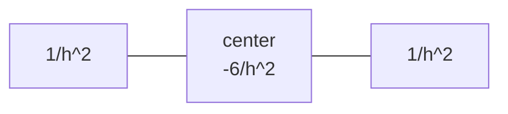
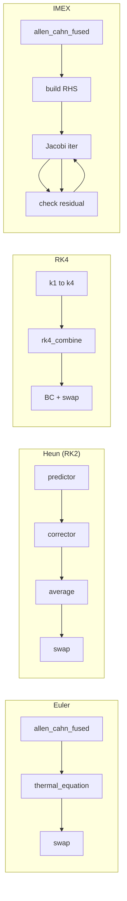
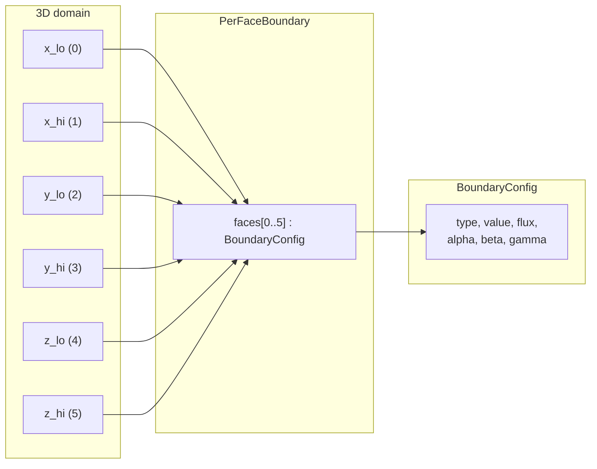
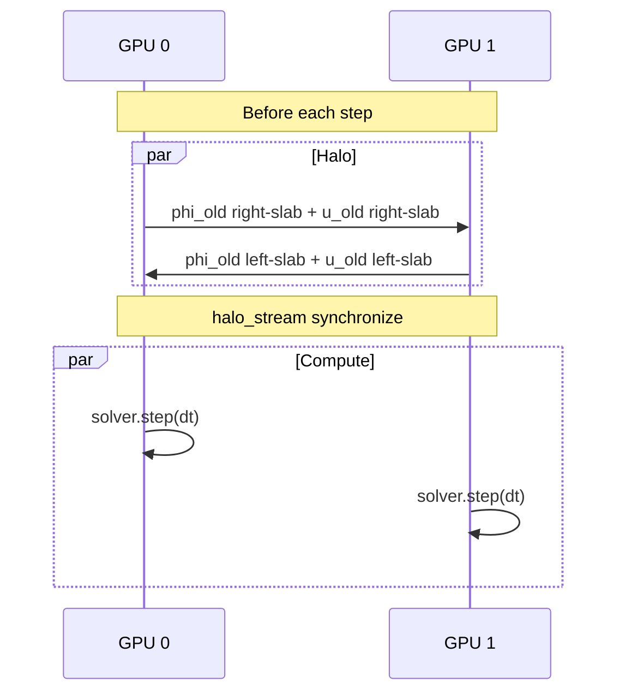
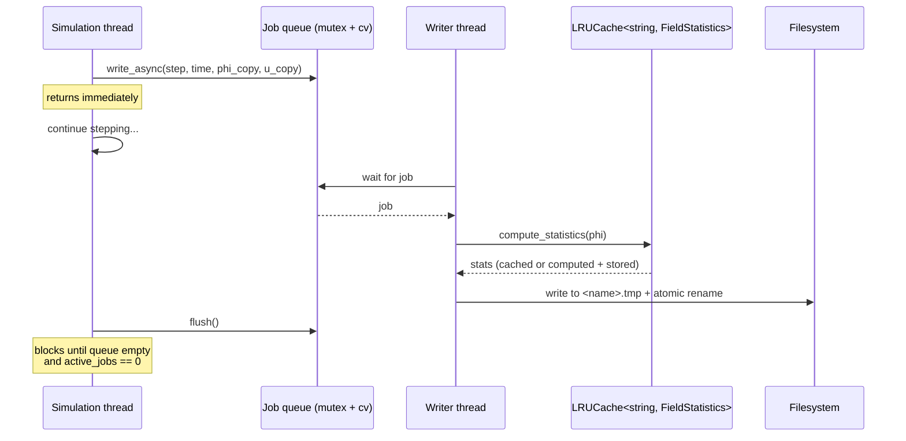
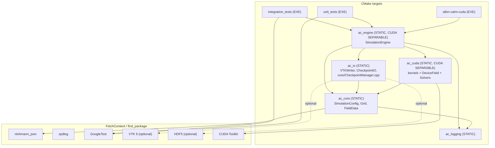

# Design Document

This document covers the algorithms, data structures, numerical schemes, and
multi-GPU strategy used by Allen-Cahn-CUDA. Every claim cites the source file
and line where it lives.

---

## 1. Mathematical Model

### 1.1 Allen–Cahn equation (phase field)

The phase-field variable `phi` evolves under the Karma–Rappel anti-trapping
formulation:

```
tau(n) * dphi/dt = div(F) - dF/dphi
```

where `F` is the anisotropic gradient flux assembled by the kernel as

```
F_i = wn^2 * phi_i  +  16 * W0 * wn * eps * dFunc_i      (i = x, y, z)
```

(see `src/cuda/AllenCahnKernels.cu:40-43` for the fused single-pass form,
and `src/cuda/Kernels.cuh` for the helpers).

- `tau(n) = tau0 * A(n)^2` — orientation-dependent relaxation time.
- `wn = W0 * A(n)` — orientation-dependent interface width.
- `A(n)` — cubic anisotropy with 4-fold symmetry. For `|grad phi|^2 > 1e-30`:

  ```
  A(n) = (1 - 3*eps) * (1 + (4*eps / (1 - 3*eps)) * (qrt / sq^2))
  ```

  with `sq = sum(phi_i^2)` and `qrt = sum(phi_i^4)`. For the degenerate
  `|grad phi|^2 <= 1e-30` case the kernel returns the **spherical average**
  `1 - 3*eps/5` (`Kernels.cuh:153-163`). This is the average of A over the
  unit sphere using `<n_i^4> = 1/5`, giving `<sum n_i^4> = 3/5`. The earlier
  value `1 - 5*eps/3` was a bug, now fixed.

- `dFunc(l, m, n) = (l^3 (m^2 + n^2) - l (m^4 + n^4)) / (l^2 + m^2 + n^2)^2`
  (`Kernels.cuh:166-172`).
- `dF/dphi = -phi*(1 - phi^2) + lambda * u * (1 - phi^2)^2`
  (`Kernels.cuh:175-179`).

### 1.2 Thermal-diffusion equation

```
du/dt = D * Laplacian(u) + 0.5 * dphi/dt
```

The kernel discretises the latent-heat term as `0.5 * (phi_new - phi_old)`,
which is `0.5 * dt * dphi/dt` to leading order in `dt`
(`src/cuda/ThermalKernels.cu:25-28`):

```cpp
double lap_u       = laplacian(u_old, x, y, z, p);
double latent_heat = 0.5 * (phi_new[c] - phi_old[c]);
u_new[c] = u_old[c] + latent_heat + p.dt * p.D * lap_u;
```

For the higher-order RK paths, `thermal_rhs_kernel` evaluates the right-hand
side at each stage as `D * Lap(u) + 0.5 * k_phi`, where `k_phi` is the
Allen–Cahn RHS for that stage (`ThermalKernels.cu:36-54`).

### 1.3 Karma–Rappel parameter relations

Defined in `src/core/SimulationConfig.hpp:35-41`:

```cpp
Real a1 = 1.25 / std::sqrt(2.0);   // ≈ 0.8839
Real a2 = 0.64;
Real lambda() const { return W0 * a1 / d0; }
Real tau0()   const { return (W0*W0*W0 * a1 * a2) / (d0 * D)
                          + (W0*W0 * beta0) / d0; }
```

The `beta0` term is the kinetic-coefficient contribution (defaults to 0).

---

## 2. Spatial Discretization

### 2.1 7-point standard Laplacian

Second-order central differences on the 6 face neighbours
(`src/cuda/Kernels.cuh:95-108`):

```
Lap(phi) = (phi[x+1] + phi[x-1] - 2*phi[c]) / dx^2
         + (phi[y+1] + phi[y-1] - 2*phi[c]) / dy^2
         + (phi[z+1] + phi[z-1] - 2*phi[c]) / dz^2
```

Stencil:



### 2.2 27-point isotropic Laplacian (Patra–Karttunen)

Improved-isotropy 2nd-order stencil over all 26 neighbours, requires
`dx = dy = dz = h` (`Kernels.cuh:110-138`):

```
Lap(phi) = (14*sum_face + 3*sum_edge + 1*sum_corner - 128*phi_center) / (30*h^2)
```

| Neighbour type | Count | Per-neighbour weight | Sum  |
|----------------|-------|----------------------|------|
| Face           | 6     | 14/30                | 84/30 |
| Edge           | 12    | 3/30                 | 36/30 |
| Corner         | 8     | 1/30                 | 8/30  |
| Center         | 1     | −128/30              | −128/30 |

Consistency check: `84 + 36 + 8 = 128`. The configuration parser refuses
the 27-point stencil when grid spacings differ
(`SimulationConfig.cpp:248-253`).

### 2.3 Gradient stencils

**2nd-order central** (used in production kernels,
`Kernels.cuh:53-67`):

```
grad_x phi = (phi[x+1] - phi[x-1]) / (2*dx)
```

**4th-order central** (available, used in tests,
`Kernels.cuh:71-91`):

```
grad_x phi = (-phi[x+2] + 8*phi[x+1] - 8*phi[x-1] + phi[x-2]) / (12*dx)
```

### 2.4 Memory layout

Row-major XYZ, identical on host (`FieldData.hpp:38-40`) and device
(`Kernels.cuh:40-42`):

```
index(x, y, z) = x * Ny * Nz + y * Nz + z
```

The intermediate is computed in `long long` to avoid overflow on grids
near `INT_MAX/8`.

---

## 3. Time Integration Schemes

All schemes are implemented in `src/cuda/CudaSolver.cu`.

### 3.1 Forward Euler

```
phi_new = phi_old + dt * f(phi_old, u_old)        # allen_cahn_fused
u_new   = u_old + 0.5*(phi_new - phi_old) + dt*D*Lap(u_old)   # thermal_equation
```

Then `swap(phi_old, phi_new); swap(u_old, u_new)` (O(1) pointer swap).
Boundary conditions are applied to `phi_new` and `u_new` between the
two updates and at the end (`CudaSolver.cu:195-215`).

### 3.2 Heun (RK2)

Two-stage predictor–corrector
(`CudaSolver.cu:233-276`):

```
# Stage 1 (predictor)
phi_tmp = AllenCahn(phi_old, u_old)
u_tmp   = Thermal  (u_old, phi_tmp, phi_old)

# Stage 2 (corrector)
phi_new = AllenCahn(phi_tmp, u_tmp)
u_new   = Thermal  (u_tmp, phi_new, phi_tmp)

# Average
phi_new = 0.5 * (phi_old + phi_new)
u_new   = 0.5 * (u_old   + u_new)
```

The `average_kernel` writes back into `phi_new`/`u_new` and intentionally
allows aliasing of input and output for that operand
(`CudaSolver.cu:223-231`).

### 3.3 Classical RK4

Four stages computing `k1..k4` of phi and u via `compute_force_kernel`,
`allen_cahn_rhs_kernel`, and `thermal_rhs_kernel`, then a final
`rk4_combine_kernel`:

```
y_new = y_old + (dt/6) * (k1 + 2*k2 + 2*k3 + k4)
```

(`CudaSolver.cu:312-410`). The non-fused kernel path uses the dedicated
force arrays `Fx_, Fy_, Fz_` and RHS arrays `k1..k4`.

### 3.4 IMEX (explicit AC + implicit thermal)

The Allen–Cahn equation is integrated explicitly. The thermal equation
becomes `(I − dt*D*Lap) u_new = u_old + 0.5*(phi_new − phi_old)` and is
solved by Jacobi iteration (`CudaSolver.cu:415-470`):

| Constant            | Value | Source                 |
|---------------------|-------|------------------------|
| `JACOBI_MAX_ITERS`  | 200   | `CudaSolver.cu:438`    |
| `JACOBI_CHECK_FREQ` | 10    | `CudaSolver.cu:439`    |
| `JACOBI_TOL`        | 1e-10 | `CudaSolver.cu:440`    |

Convergence is checked every `JACOBI_CHECK_FREQ` iterations via
`launch_max_abs_diff(u_new, u_tmp, ...)`; the loop breaks early when the
residual drops below `JACOBI_TOL`.



---

## 4. Adaptive Time Stepping & CFL

`SimulationEngine::adapt_time_step` (`SimulationEngine.cu:208-236`) does
three things:

1. Reads `max_dphi = solver_->compute_max_dphi()`
   (parallel reduction of `|phi_new − phi_old|`).
2. Targets `adaptive_tolerance` per step:
   `new_dt = dt * clamp(0.9 * tolerance / max_dphi, 0.5, 1.5)`.
3. Clamps to the joint CFL of thermal and phase-field diffusivity.

CFL constants (also enforced by `SimulationConfig::validate`):

```
inv_h2_sum = 3 / min(dx, dy, dz)^2
thermal_cfl = cfl_safety / (2 * D       * inv_h2_sum)
A_max       = 1 + epsilon
D_phi       = W0^2 * A_max^2 / tau0
phi_cfl     = cfl_safety / (2 * D_phi   * inv_h2_sum)
new_dt      = clamp(min(new_dt, min(thermal_cfl, phi_cfl)),
                    dt_min, dt_max)
```

(`SimulationEngine.cu:217-228`, `SimulationConfig.cpp:281-292`).

The validator also rejects:
- `block_size_1d` outside `[32, 1024]` or not a multiple of 32
  (`SimulationConfig.cpp:336-341`).
- `time.adaptive_tolerance <= 0` when `time.adaptive == true`
  (`SimulationConfig.cpp:312-315`).
- `output.format` other than `"vts"` or `"raw"`
  (`SimulationConfig.cpp:297-299`).
- `checkpoint.keep_last < 1`, `initial.seed_radius <= 0`,
  `epsilon` outside `[0, 1/3)`, etc.

---

## 5. Boundary Conditions

`BoundaryKernels.cu` implements four BC types — Dirichlet, Neumann,
Periodic, Robin — applied per face. Each face is launched as a 2D kernel
covering its surface; corners and edges follow an explicit ownership rule
to avoid double writes (X faces own their full plane, Y excludes
X-edges, Z excludes both — see `BoundaryKernels.cu:44-52`).

The six faces are launched in **Z, Y, X** order so periodic / coupled
faces see the values written by the others before reading
(`BoundaryKernels.cu:200-208`).

### 5.1 Per-face BC system

`SimulationConfig.hpp` defines:

```cpp
struct PerFaceBoundary {
    std::array<BoundaryConfig, 6> faces;   // x_lo, x_hi, y_lo, y_hi, z_lo, z_hi
};
struct AllBoundaryConfig {
    BoundaryConfig    phi_bc, u_bc;        // uniform fallback
    PerFaceBoundary   phi_faces, u_faces;  // per-face overrides
    bool              per_face = false;    // selector
};
```

`CudaSolver::apply_bc_per_face` dispatches to the per-face launcher when
`per_face == true`, else to the uniform launcher
(`CudaSolver.cu:478-482`).



Robin BC enforces `alpha*u + beta*du/dn = gamma`. The validator forbids
`alpha == 0 && beta == 0` for any Robin face
(`SimulationConfig.cpp:317-330`).

---

## 6. Saturation Guard

`SimulationEngine::check_saturation` (`SimulationEngine.cu:177-180`)
calls `solver_->compute_boundary_max_phi()`, which is an O(N²)
boundary-only reduction implemented in
`CudaSolver::compute_boundary_max_phi` (`CudaSolver.cu:498-565`).
It iterates over the six 1-cell-thick boundary slabs, computes the
maximum, and triggers a clean shutdown if it exceeds
`time.saturation_threshold` (default `-0.5`). This avoids the late-time
numerical blow-up that would otherwise occur once the solid touches the
domain wall.

---

## 7. Multi-GPU Strategy

`MultiGPUSolver` (`src/cuda/MultiGPUSolver.cu`) decomposes the domain
along the X-axis with halo width 2:

| Field                     | Value | Source                       |
|---------------------------|-------|------------------------------|
| `halo_width_`             | 2     | `MultiGPUSolver.cu:22`       |
| Decomposition axis        | X     | `MultiGPUSolver.cu:46-61`    |
| Inter-GPU BC              | Neumann (zero-flux) | `MultiGPUSolver.cu:69-83` |

For each pair of neighbouring GPUs, two halo slabs (left→right and
right→left) of two cells each are exchanged via `cudaMemcpyPeerAsync` on
a dedicated `halo_stream`. CUDA events synchronise the halo stream with
each side's compute stream (`MultiGPUSolver.cu:151-187`).

Heun and IMEX in multi-GPU mode require an inter-stage halo exchange of
the temporary arrays via `exchange_halos_for_tmp()`
(`MultiGPUSolver.cu:250-273`). RK4 in multi-GPU mode currently issues a
warning that inter-stage halo exchange is approximated — error is
confined to ~2 cells at each interior GPU boundary (`MultiGPUSolver.cu:274-290`).



---

## 8. Checkpointing

### 8.1 On-disk format

Defined in `src/io/CheckpointIO.hpp:18-33`:

```cpp
#pragma pack(push, 1)
struct Header {
    char     magic[8] = {'A','C','C','H','K','P','T','\0'};
    int      version  = 1;
    int      Nx, Ny, Nz;
    double   dx, dy, dz;
    double   dt, time;
    int      step;
    int      num_fields;       // always 2 (phi, u)
    uint32_t data_crc32;       // 0 = no checksum (legacy)
    char     reserved[52];
};
#pragma pack(pop)
static_assert(sizeof(Header) == 128, ...);
```

Layout on disk: `[Header][phi_data][u_data]`. The CRC32 covers the
concatenated field bytes; the table is generated once in
`CheckpointIO::compute_crc32` and reused by both writer and reader
(`CheckpointIO.cpp:14-30`).

### 8.2 Write protocol (crash-safe)

`CheckpointIO::write` (`CheckpointIO.cpp:32-118`) does:

1. `open` `path.tmp` with `O_WRONLY | O_CREAT | O_TRUNC`.
2. Compute CRC32 over `[phi || u]`.
3. POSIX `write()` of header + phi + u, retrying on `EINTR`.
4. `fsync(fd)`, `close(fd)`.
5. `rename(path.tmp, path)` (atomic on POSIX).
6. `open(parent_dir)` + `fsync` to make the rename durable.

### 8.3 Read protocol

`CheckpointIO::read` (`CheckpointIO.cpp:120-203`) validates magic,
version, dimension sanity (`1 <= N <= 100000`), positive grid spacing,
and the CRC32 if present. `SimulationEngine::initialize_from_checkpoint`
additionally rejects a checkpoint whose grid dimensions do not match the
current config (`SimulationEngine.cu:100-118`).

### 8.4 Rolling retention

`CheckpointManager` (`src/core/CheckpointManager.cpp`) writes
`checkpoint_step_<NNNN>.bin` on every `frequency`-th step and prunes the
oldest file when `keep_last` is exceeded. `restore()` walks the directory
in descending step order, returning the first checkpoint that passes
size and header validation; truncated mid-write files are skipped.

---

## 9. Async I/O Pipeline (`VTKWriter`)

`src/io/VTKWriter.cpp` runs a single background writer thread:



Key invariants:

- `stop_` is read+modified under `queue_mutex_`; the destructor sets it
  and `notify_all()`-s before joining the thread (`VTKWriter.cpp:30-39`).
- The producer (`write_async`) blocks via `queue_cv_.wait()` when the
  queue depth + in-flight jobs would exceed `max_queue_depth_`,
  providing backpressure (`VTKWriter.cpp:41-56`).
- VTK output uses an atomic temp-file + `std::filesystem::rename` so a
  crash mid-write never leaves a corrupted `.vts` (`VTKWriter.cpp:113-166`).
- Raw output uses POSIX `write()` + atomic rename for the same reason
  (`VTKWriter.cpp:168-190`).
- Field statistics (min, max, mean, L2-norm) are cached by
  `step:fieldname` in an `LRUCache<string, FieldStatistics>`
  (`VTKWriter.cpp:192-224`).

---

## 10. Concurrent Data Structures

| Structure         | Header                       | Synchronization                     | Use |
|-------------------|------------------------------|-------------------------------------|-----|
| `LRUCache<K,V>`   | `src/core/LRUCache.hpp`       | `std::shared_mutex`                 | VTK statistics cache (writer thread + main thread) |
| `ConcurrentMap<K,V>` | `src/core/ConcurrentMap.hpp` | 16 `std::shared_mutex` shards (lock striping) | Future high-contention shared state |
| `SpatialHash<V>`  | `src/core/SpatialHash.hpp`    | None — build-then-query                | 3D bucketing of field coordinates (FNV-1a hash) |

`ConcurrentMap` shard count is fixed at 16 (`ConcurrentMap.hpp:22`),
chosen to roughly match common GPU host CPU counts. The shard index is
`std::hash(key) % NUM_SHARDS`.

---

## 11. Build System



`CheckpointManager.cpp` lives under `src/core/` but is compiled into
`ac_io` because `CheckpointManager.hpp` includes `io/CheckpointIO.hpp`
(`src/CMakeLists.txt:40-46`).

---

## 12. Performance & Optimisation Notes

These optimisations are implemented in the codebase; benchmarking specific
to your hardware should be done with `make cuda-run-default` against
`config/default.json` to obtain ground-truth numbers.

| Optimisation | Where | Rationale |
|--------------|-------|-----------|
| Fused Allen–Cahn kernel | `AllenCahnKernels.cu:10-99` | Eliminates `Fx`/`Fy`/`Fz` global arrays; trades extra arithmetic for ~3× memory-bandwidth reduction on this kernel. |
| O(1) field swap | `DeviceField.cuh` (friend `swap`) | Pointer swap replaces `cudaMemcpy` of full fields per step. |
| Pre-allocated reduction scratch | `CudaSolver.cu:127-134` | Avoids per-call `cudaMalloc` in the reduction launcher. |
| Grid-stride reduction kernels | `ReductionKernels.cu` | Reductions correctly cover all elements even when scratch is undersized — no silent loss. |
| Atomic file writes | `VTKWriter.cpp:151-160`, `CheckpointIO.cpp:99-113` | `tmp + rename` (+ parent dir `fsync` for checkpoints) makes crash-mid-write recoverable. |
| Boundary-only saturation reduction | `CudaSolver.cu:498-565` | O(N²) instead of O(N³); avoids full host transfer. |
| `__launch_bounds__(256)` on hot kernels | various `.cu` files | Bounds register pressure for predictable occupancy. |
