# Design Document

## Mathematical Model

### Allen-Cahn Equation (Phase Field)

The phase-field variable phi evolves according to:

```
tau(n) * dphi/dt = div(W(n)^2 * grad(phi)) + div(|grad(phi)|^2 * W(n) * dW/d(grad(phi))) - dF/dphi
```

where:
- `tau(n) = tau0 * A(n)^2` is the orientation-dependent relaxation time
- `W(n) = W0 * A(n)` is the orientation-dependent interface width
- `A(n) = (1 - 3*eps) * (1 + 4*eps/(1-3*eps) * (nx^4 + ny^4 + nz^4)/(nx^2 + ny^2 + nz^2)^2)` is the cubic anisotropy function with 4-fold symmetry, where `n = grad(phi)/|grad(phi)|`
- `dF/dphi = -phi*(1-phi^2) + lambda*u*(1-phi^2)^2` is the double-well + coupling term

### Thermal Diffusion

The dimensionless temperature u evolves according to:

```
du/dt = D * Laplacian(u) + 0.5 * dphi/dt
```

The `0.5 * dphi/dt` term represents latent heat release at the solidification front.

### Derived Parameters

```
lambda = W0 * a1 / d0       (coupling strength)
tau0 = (W0^3 * a1 * a2) / (d0 * D) + (W0^2 * beta0) / d0
```

where `a1 = 1.25/sqrt(2)`, `a2 = 0.64`, `d0` is capillary length.

## Spatial Discretization

### 7-Point Standard Laplacian

Second-order accurate, uses 6 face neighbors:

```
Lap(phi) = (phi[x+1] + phi[x-1] - 2*phi[x]) / dx^2
         + (phi[y+1] + phi[y-1] - 2*phi[y]) / dy^2
         + (phi[z+1] + phi[z-1] - 2*phi[z]) / dz^2
```

Stencil weights (assuming dx = dy = dz = h):

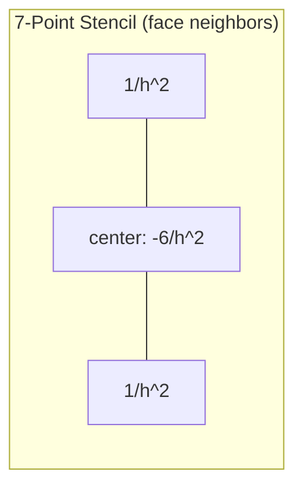

### 27-Point Isotropic Laplacian (Kumar 2004)

Fourth-order isotropic, uses all 26 neighbors:

```
Lap(phi) = (4 * sum_face + 2 * sum_edge + 1 * sum_corner - 56 * phi_center) / (26 * h^2)
```

| Neighbor Type | Count | Weight (per neighbor) | Total Weight |
|---------------|-------|-----------------------|-------------|
| Face | 6 | 4/26 | 24/26 |
| Edge | 12 | 2/26 | 24/26 |
| Corner | 8 | 1/26 | 8/26 |
| Center | 1 | -56/26 | -56/26 |

Verification: 24 + 24 + 8 - 56 = 0 (consistent discrete Laplacian).

### Gradient Stencils

**2nd-order central differences** (used in production kernels):

```
d(phi)/dx = (phi[x+1] - phi[x-1]) / (2*dx)
```

**4th-order central differences** (available but not used in fused kernel):

```
d(phi)/dx = (-phi[x+2] + 8*phi[x+1] - 8*phi[x-1] + phi[x-2]) / (12*dx)
```

## Time Integration Schemes

### Euler (1st order)

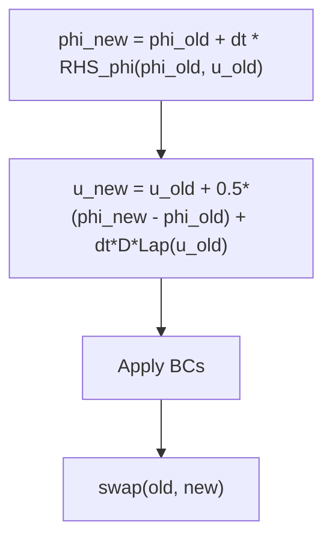

Single function evaluation per step. Stability requires `dt < h^2/(2*D*3)` (CFL condition).

### Heun / RK2 (2nd order)

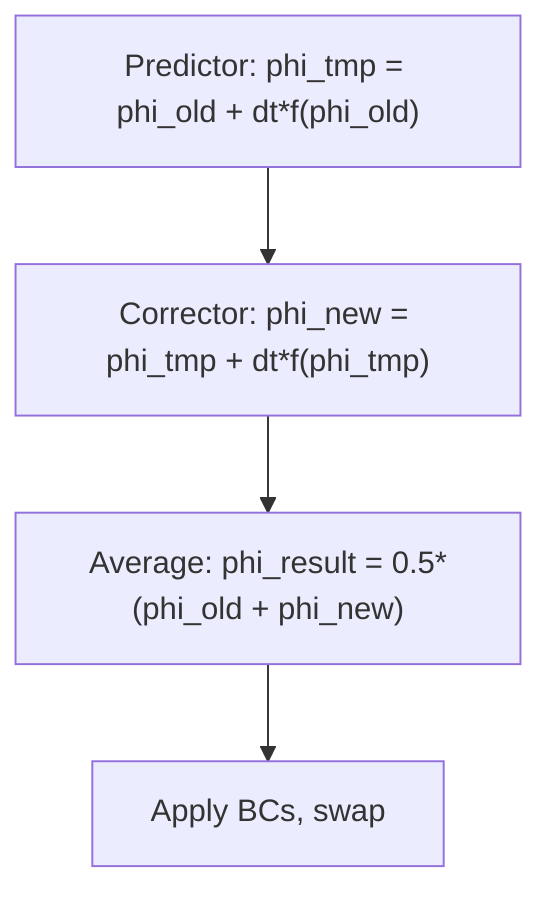

Two function evaluations per step. Local truncation error O(dt^3).

### Classical RK4 (4th order)

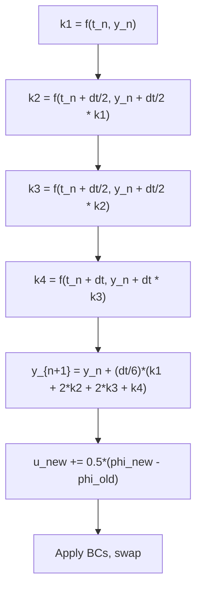

Four function evaluations per step. Uses separate `compute_force_kernel` + `allen_cahn_rhs_kernel` + `thermal_rhs_kernel` per stage (not fused, requires Fx, Fy, Fz arrays).

Latent heat is added as a post-processing step because `thermal_rhs_kernel` computes only `D*Lap(u)` for use with the standard RK4 combination formula.

### IMEX (Mixed order)

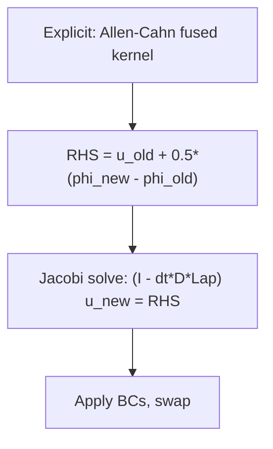

Implicit treatment of thermal diffusion allows larger time steps. The Jacobi iteration solves:

```
u_new[c] = (RHS[c] + dt*D * sum_neighbors/h^2) / (1 + dt*D * 6/h^2)
```

Uses 50 iterations. Convergence guaranteed when spectral radius `rho = 1 - pi^2 * dt * D / L^2 < 1`.

## Kernel Fusion Optimization

### Original Design (13.6 GB for 600^3)

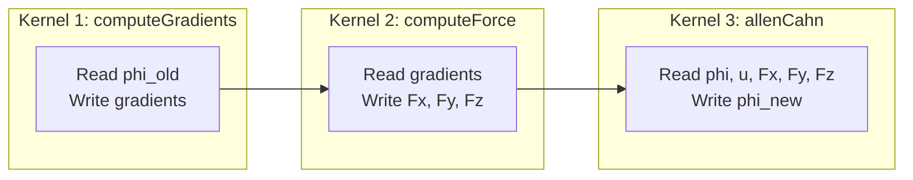

**Memory cost:** phi_old + phi_new + u_old + u_new + Fx + Fy + Fz + IDx + IDy + IDz = 10 arrays

### Fused Design (6.4 GB for 600^3)

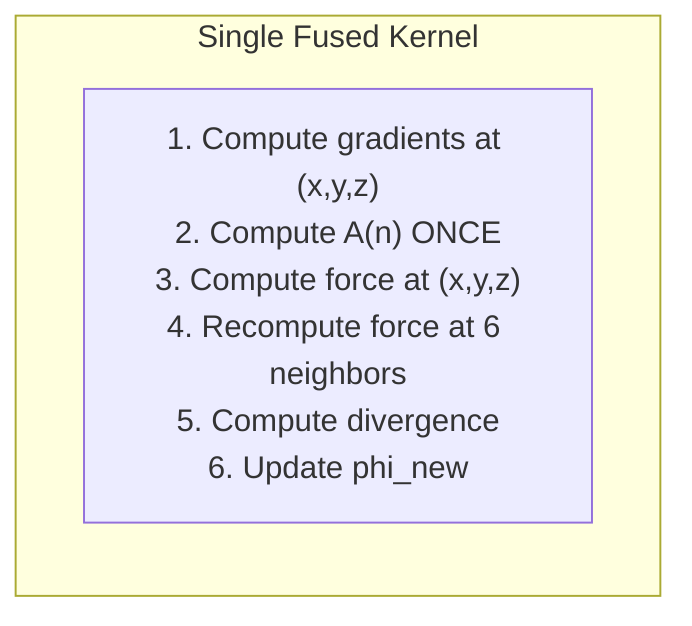

**Trade-off:** Recomputes anisotropy at 6 neighbor points (7x total including center) instead of reading from separate force arrays. This is compute-bound rather than memory-bound, which favors modern GPU architectures.

**Savings:** Eliminates Fx, Fy, Fz (3 arrays) + IDx, IDy, IDz (3 arrays) = 7.2 GB for 600^3.

## GPU Memory Management

### DeviceField RAII Pattern

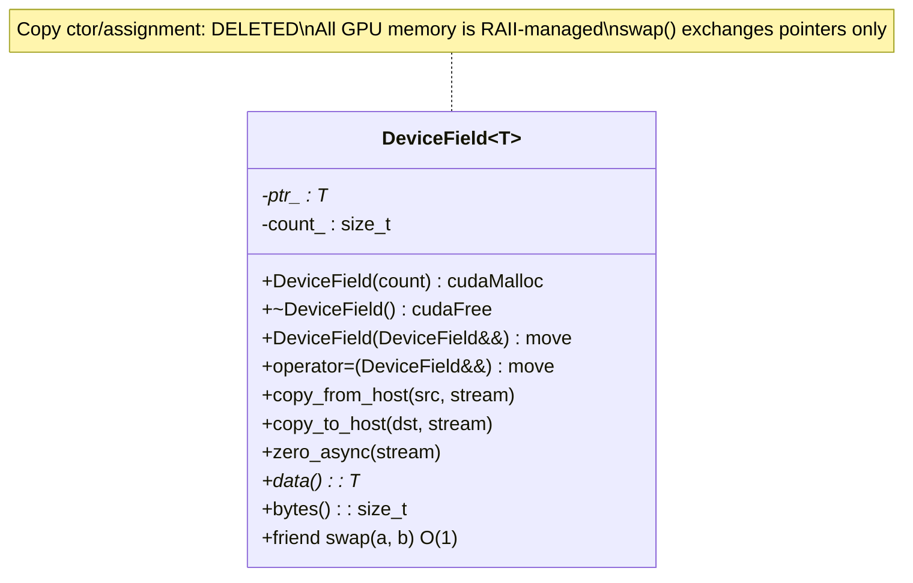

### Pointer Swap Strategy

Instead of a GPU kernel copying `N^3` doubles:

```cpp
// OLD: O(N) GPU kernel
swap_kernel<<<grid, block>>>(phi_old, phi_new, N);

// NEW: O(1) host-side pointer swap
swap(phi_old_, phi_new_);  // std::swap on pointers
```

## Parallel Reduction Algorithm

Used for `compute_max_dphi()` (adaptive time stepping).

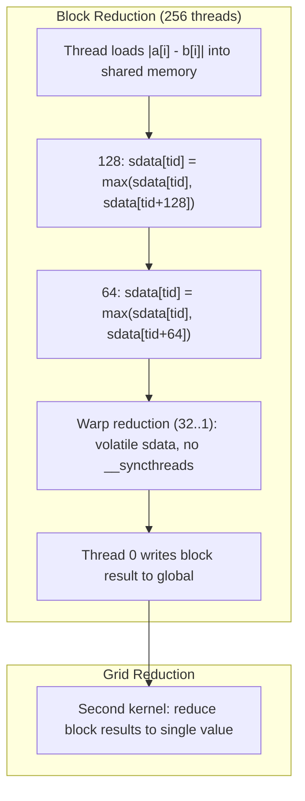

**Complexity:** O(N/P) work per thread, O(log P) steps per block, where P = block size.

## Data Structure Design

### LRU Cache

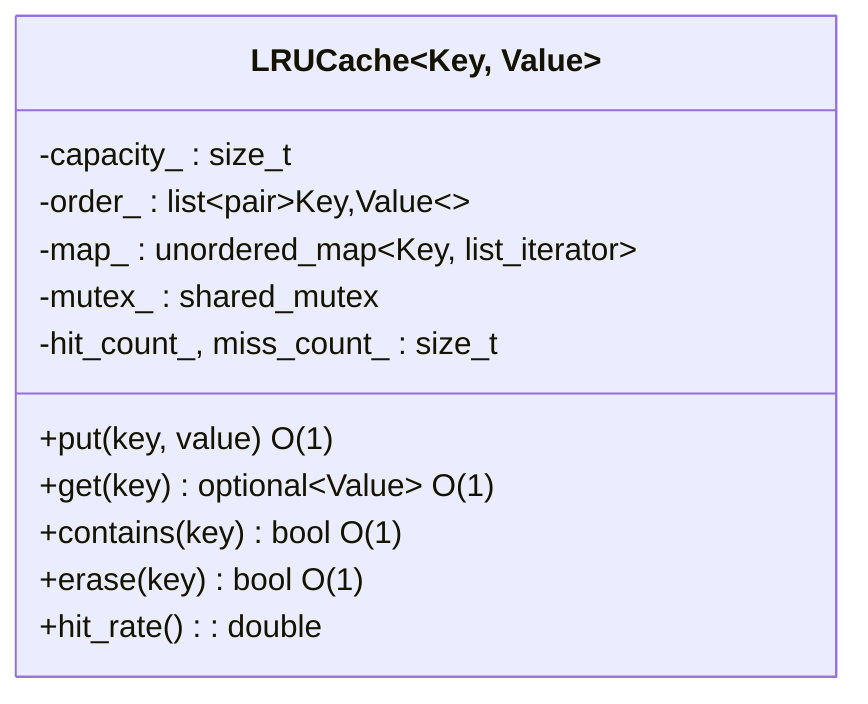

| Operation | Time | Lock Type |
|-----------|------|-----------|
| `put()` | O(1) amortized | Exclusive |
| `get()` | O(1) | Exclusive (promotes) |
| `contains()` | O(1) | Shared (no promote) |
| `erase()` | O(1) | Exclusive |

**Implementation:** Doubly-linked list maintains LRU ordering (front = MRU, back = LRU). Hash map provides O(1) lookup by key to list iterator. On access, the entry is spliced to the front. On eviction, the back entry is removed.

### Spatial Hash Map

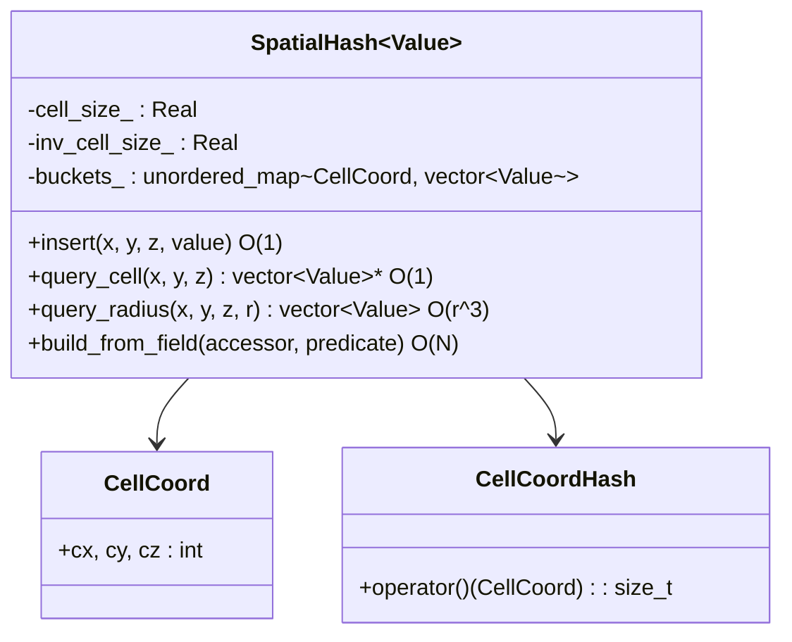

**Hash function:** FNV-1a mixing for 3D integer coordinates:

```
h = 14695981039346656037
h = (h XOR cx) * 1099511628211
h = (h XOR cy) * 1099511628211
h = (h XOR cz) * 1099511628211
```

### Concurrent Hash Map

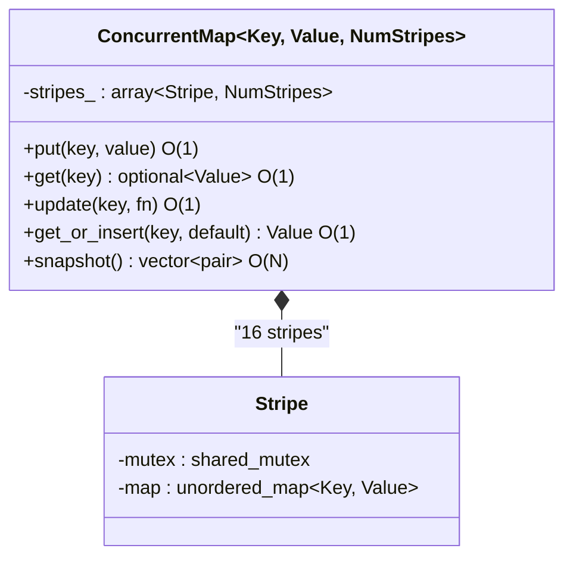

**Design:** 16 independent stripes, each with its own `shared_mutex` and `unordered_map`. Key is hashed and modulo-distributed across stripes. This reduces lock contention by 16x compared to a single-mutex approach.

| Operation | Time | Lock Type |
|-----------|------|-----------|
| `put()` | O(1) | Exclusive (one stripe) |
| `get()` | O(1) | Shared (one stripe) |
| `update()` | O(1) | Exclusive (one stripe) |
| `size()` | O(stripes) | Shared (all stripes) |
| `snapshot()` | O(N) | Shared (all stripes) |

## Boundary Condition Implementation

### Face Enumeration

```
Face Index:  0     1     2     3     4     5
Face Name:  X_Lo  X_Hi  Y_Lo  Y_Hi  Z_Lo  Z_Hi
Axis:        0     0     1     1     2     2
Side:        0     1     0     1     0     1
```

### Robin BC Derivation

Robin condition: `alpha * u + beta * du/dn = gamma`

Using one-sided finite difference for du/dn at the boundary:
```
du/dn ~ (u_bnd - u_inner) / (sign * ds)
```

Substituting:
```
alpha * u_bnd + beta * (u_bnd - u_inner) / (sign * ds) = gamma
u_bnd * (alpha + beta/(sign*ds)) = gamma + beta * u_inner / (sign*ds)
u_bnd = (gamma + beta*u_inner/(sign*ds)) / (alpha + beta/(sign*ds))
```

Division-by-zero protection: falls back to `u_inner` when denominator < 1e-30.

## Performance Optimization Summary

| Optimization | Technique | Impact |
|-------------|-----------|--------|
| Index elimination | Compute from threadIdx | -2.4 GB (600^3) |
| Kernel fusion | Recompute force at neighbors | -4.8 GB (600^3) |
| Pointer swap | std::swap on host pointers | O(N) -> O(1) per step |
| Anisotropy dedup | Compute A(n) once per thread (was 8x) | ~7x fewer transcendentals |
| Warp reduction | Unrolled last warp, no __syncthreads | 2x faster reduction |
| Async I/O | Background writer thread | Zero simulation blocking |
| LRU stats cache | Hash map + linked list | O(1) cached field statistics |
| Striped concurrent map | 16 independent mutexes | 16x less lock contention |
| Spatial hashing | FNV-1a 3D bucketing | O(1) region queries |
| RAII GPU memory | DeviceField destructor | Zero memory leaks |
