# Mathematical Theory: Allen-Cahn Phase-Field Model for Dendritic Solidification

> **Comprehensive mathematical reference** for the Allen-Cahn CUDA phase-field
> simulation code. This document covers the governing equations, discretization
> schemes, anisotropy model, boundary conditions, stability analysis, and
> numerical methods implemented in the solver.

---

## Table of Contents

1. [Introduction](#1-introduction)
2. [Free Energy Functional](#2-free-energy-functional)
3. [Governing Equations](#3-governing-equations)
4. [Anisotropy Model](#4-anisotropy-model)
5. [Nondimensionalization](#5-nondimensionalization)
6. [Spatial Discretization](#6-spatial-discretization)
7. [Gradient Operators](#7-gradient-operators)
8. [Time Integration Schemes](#8-time-integration-schemes)
9. [Boundary Conditions](#9-boundary-conditions)
10. [Stability Analysis](#10-stability-analysis)
11. [Kernel Fusion Optimization](#11-kernel-fusion-optimization)
12. [Multi-GPU Domain Decomposition](#12-multi-gpu-domain-decomposition)
13. [Advanced Data Structures](#13-advanced-data-structures)
14. [References](#14-references)

---

## 1. Introduction

Phase-field models provide a powerful framework for simulating microstructural
evolution during solidification. Instead of tracking the sharp solid-liquid
interface explicitly (a moving boundary problem), the phase-field approach
introduces a continuous **order parameter** `φ(x,t)` that varies smoothly
across a diffuse interface of characteristic width `W`.

| Region | Phase Field Value | Physical Meaning |
|--------|-------------------|------------------|
| Solid  | `φ = +1`          | Fully solidified  |
| Liquid | `φ = -1`          | Fully liquid      |
| Interface | `-1 < φ < +1`  | Diffuse transition zone |

This approach naturally handles:
- **Topological changes** (merging/splitting of dendrite arms)
- **Complex geometries** (no mesh conforming to the interface)
- **Anisotropic growth** (crystallographic orientation effects)
- **Thermal coupling** (latent heat release during solidification)

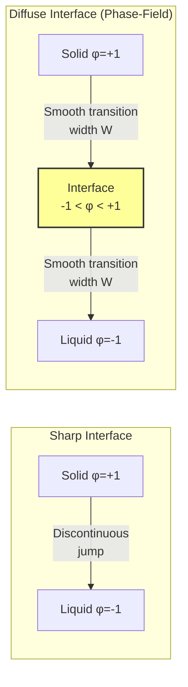

The key advantage of the diffuse interface approach is that the interface
position is implicitly defined by the `φ = 0` contour, eliminating the need
for explicit interface tracking algorithms.

---

## 2. Free Energy Functional

The total free energy of the system is given by the Ginzburg-Landau functional:

```
F[φ, u] = ∫ [ (W²/2)|∇φ|² + f(φ) + λ·g(φ,u) ] dV
```

where:
- `(W²/2)|∇φ|²` — **gradient energy** penalizing spatial variations in `φ`
- `f(φ)` — **double-well potential** providing two stable phases
- `λ·g(φ,u)` — **coupling term** between phase field and temperature

### Double-Well Potential

The double-well potential takes the standard form:

```
f(φ) = -φ²/2 + φ⁴/4
```

This potential has:
- Two minima at `φ = ±1` (solid and liquid phases)
- A local maximum at `φ = 0` (unstable interface state)
- Energy barrier height of `1/4`

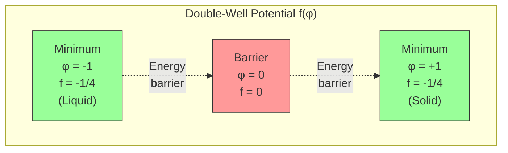

### Free Energy Derivative

The variational derivative of `F` with respect to `φ` yields the driving
force for the Allen-Cahn equation:

```
δF/δφ = -W²∇²φ + f'(φ) + λ·∂g/∂φ
```

In the code, the free energy derivative (reaction term) is implemented as:

```
dF_dphi(φ, u, λ) = -φ(1 - φ²) + λu(1 - φ²)²
```

The first term `-φ(1-φ²)` drives `φ` toward `±1`. The second term
`λu(1-φ²)²` couples the thermal field to the interface motion.

---

## 3. Governing Equations

The model solves two coupled partial differential equations: the **Allen-Cahn
equation** for the phase field `φ` and the **thermal diffusion equation** for
the dimensionless temperature `u`.

### 3.1 Allen-Cahn Equation

```
τ₀·A(n̂)² · ∂φ/∂t = W₀²·∇·[A(n̂)²·∇φ] 
                    + W₀²·∂/∂xⱼ[|∇φ|²·A(n̂)·∂A/∂(∂φ/∂xⱼ)]
                    + φ(1-φ²) - λu(1-φ²)²
```

where:
- `τ₀` — relaxation time scale
- `A(n̂)` — anisotropy function (see Section 4)
- `W₀` — interface width parameter
- `λ` — coupling constant
- `n̂ = ∇φ/|∇φ|` — interface normal direction

The code implements this by defining a **force vector** `F = (Fx, Fy, Fz)`:

```
Fx = wn²·∂φ/∂x + |∇φ|²·wn·16·W₀·ε·dFunc(∂φ/∂x, ∂φ/∂y, ∂φ/∂z)
Fy = wn²·∂φ/∂y + |∇φ|²·wn·16·W₀·ε·dFunc(∂φ/∂y, ∂φ/∂z, ∂φ/∂x)
Fz = wn²·∂φ/∂z + |∇φ|²·wn·16·W₀·ε·dFunc(∂φ/∂z, ∂φ/∂x, ∂φ/∂y)
```

where `wn = W₀·A(n̂)` and `τn = τ₀·A(n̂)²`.

The update becomes:

```
φ^{n+1} = φ^n + (Δt/τn)·[∇·F - dF_dphi(φ, u, λ)]
```

### 3.2 Thermal Diffusion Equation

```
∂u/∂t = D·∇²u + (1/2)·∂φ/∂t
```

where:
- `D` — thermal diffusivity
- `(1/2)·∂φ/∂t` — latent heat source term

Discretized (forward Euler):

```
u^{n+1} = u^n + 0.5·(φ^{n+1} - φ^n) + Δt·D·∇²u^n
```

The latent heat term `0.5·(φ^{n+1} - φ^n)` represents energy released/absorbed
during the phase transition.

```mermaid
graph TD
    A["Phase Field φ"] -->|"Anisotropy A(n̂)"| B["Allen-Cahn<br/>τ₀A²∂φ/∂t = W₀²∇·(A²∇φ) + ..."]]
    B -->|"∂φ/∂t → latent heat"| C["Thermal Field u"]
    C -->|"u couples back<br/>via λu(1-φ²)²"| B
    C -->|"Diffusion"| D["∂u/∂t = D∇²u + ½∂φ/∂t"]
    
    style A fill:#bbf,stroke:#333
    style C fill:#fbb,stroke:#333
    style B fill:#fbf,stroke:#333
    style D fill:#fbf,stroke:#333
```

---

## 4. Anisotropy Model

Crystallographic anisotropy is essential for producing realistic dendritic
morphologies. The code implements **cubic (4-fold) anisotropy** following
the formulation of Karma and Rappel (1998).

### 4.1 Anisotropy Function

The anisotropy function `A(n̂)` modulates the interface width and relaxation
time based on the interface normal direction:

```
A(n̂) = (1 - 3ε)·[1 + (4ε/(1-3ε))·(n̂x⁴ + n̂y⁴ + n̂z⁴)]
```

where `ε ∈ [0, 1/3)` is the anisotropy strength parameter.

In terms of gradient components (avoiding explicit normalization):

```
A(∇φ) = (1 - 3ε)·[1 + (4ε/(1-3ε))·(φx⁴ + φy⁴ + φz⁴)/(φx² + φy² + φz²)²]
```

**Special cases:**
- `ε = 0` → `A = 1` (isotropic growth)
- `ε → 1/3` → maximum anisotropy (faceted growth)
- `|∇φ|² < 10⁻³⁰` → `A = 1 - 3ε/5` (spherical-average isotropic limit; see below)

**Spherical-average derivation of the regularized fallback.** When
`|∇φ| → 0`, no preferred crystal direction exists, so the natural value to
return is the average of `A(n̂)` over the unit sphere. Using
`⟨n̂_i⁴⟩ = 1/5` over the unit sphere in 3D, we get
`⟨n̂x⁴ + n̂y⁴ + n̂z⁴⟩ = 3/5`, so

```
⟨A⟩_sphere = (1 − 3ε)·(1 + (4ε/(1−3ε))·(3/5))
           = (1 − 3ε) + (12ε/5)
           = 1 − 3ε/5
```

The code implements exactly this value at `Kernels.cuh:162`:

```cpp
return 1.0 - 3.0 * epsilon / 5.0;
```

### 4.2 Anisotropy Derivative (dFunc)

The force computation requires derivatives of the anisotropy function. The
helper function `dFunc` computes the directional derivative:

```
dFunc(l, m, n) = [l³(m² + n²) - l(m⁴ + n⁴)] / (l² + m² + n²)²
```

This function vanishes when `|∇φ|² < 10⁻³⁰` to avoid division by zero.

The three force components use **cyclic permutation** of the arguments:
- `Fx` uses `dFunc(φx, φy, φz)`
- `Fy` uses `dFunc(φy, φz, φx)`
- `Fz` uses `dFunc(φz, φx, φy)`

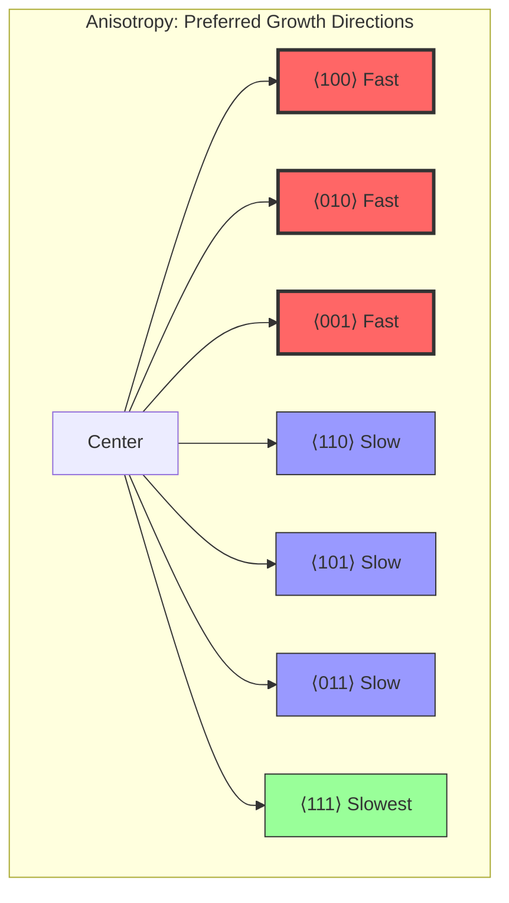

---

## 5. Nondimensionalization

The physical parameters are nondimensionalized following the
Karma–Rappel (1998) thin-interface formulation, with the capillary length
`d₀` as a free parameter:

| Parameter | Formula | Description |
|-----------|---------|-------------|
| `W₀` | Set directly | Interface width |
| `d₀` | Set directly | Capillary length |
| `D`  | Set directly | Thermal diffusivity |
| `δ`  | Set directly | Dimensionless undercooling |
| `ε`  | Set directly | Anisotropy strength, `ε ∈ [0, 1/3)` |
| `β₀` | Set directly (default 0) | Kinetic coefficient |
| `a₁` | `1.25 / √2 ≈ 0.8839` | Asymptotic constant |
| `a₂` | `0.64`  | Asymptotic constant |
| `λ`  | `W₀ · a₁ / d₀` | Coupling strength |
| `τ₀` | `(W₀³ · a₁ · a₂) / (d₀ · D) + (W₀² · β₀) / d₀` | Relaxation time |

These derived quantities are computed by `SimulationConfig::lambda()` and
`SimulationConfig::tau0()` (`src/core/SimulationConfig.hpp:35-41`):

```cpp
Real a1 = 1.25 / std::sqrt(2.0);
Real a2 = 0.64;
Real lambda() const { return W0 * a1 / d0; }
Real tau0()   const {
    return (W0*W0*W0 * a1 * a2) / (d0 * D)
         + (W0*W0 * beta0) / d0;
}
```

The first term of `τ₀` is the diffusive contribution; the second adds the
kinetic-undercooling correction, active when `β₀ ≠ 0`.

### 5.1 Initial conditions

The seed is initialised as a smooth `tanh` profile centred at the domain
midpoint (`SimulationEngine.cu:73-98`):

```
φ(x) = − tanh( (r − r₀) / (√2 · W₀) )      with r = ||x − x_c||
u(x) = − δ                                  everywhere (uniform undercooling)
```

This yields `φ ≈ +1` (solid) inside the seed and `φ ≈ −1` (liquid) outside,
with the equilibrium-width interface profile that matches the Karma–Rappel
free-energy minimiser.

---

## 6. Spatial Discretization

The code provides two Laplacian stencils on a uniform Cartesian grid with
spacing `h = dx = dy = dz`.

### 6.1 Standard 7-Point Laplacian (2nd Order)

The standard central-difference Laplacian uses only face neighbors:

```
∇²φ ≈ (φ_{i+1,j,k} + φ_{i-1,j,k} - 2φ_{i,j,k}) / dx²
     + (φ_{i,j+1,k} + φ_{i,j-1,k} - 2φ_{i,j,k}) / dy²
     + (φ_{i,j,k+1} + φ_{i,j,k-1} - 2φ_{i,j,k}) / dz²
```

**Properties:**
- 2nd-order accurate: truncation error `O(h²)`
- 7 stencil points (center + 6 face neighbors)
- Supports anisotropic grids (`dx ≠ dy ≠ dz`)
- Compact stencil: only nearest neighbors needed

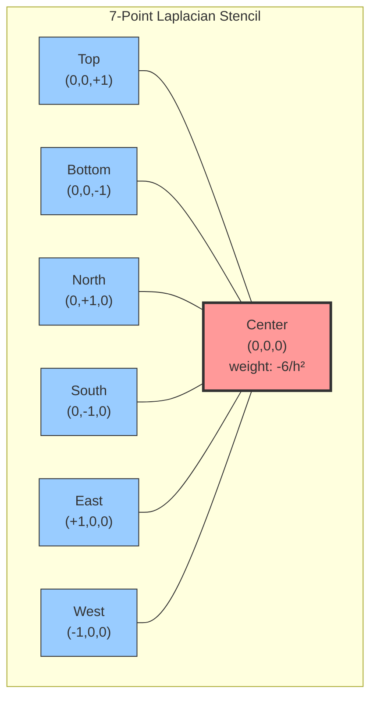

| Neighbor Type | Count | Offset | Weight per neighbor |
|---------------|-------|--------|---------------------|
| Face          | 6     | `(±1,0,0)`, `(0,±1,0)`, `(0,0,±1)` | `+1/h²` |
| Center        | 1     | `(0,0,0)` | `-6/h²` |

### 6.2 Isotropic 27-Point Laplacian (Patra–Karttunen)

The 27-point stencil reduces leading-order anisotropic discretisation
error by including edge and corner neighbours with the Patra–Karttunen
weights:

```
∇²φ ≈ (14·Σ_face + 3·Σ_edge + 1·Σ_corner − 128·φ_center) / (30·h²)
```

where:
- `Σ_face`   = sum over 6 face neighbours
- `Σ_edge`   = sum over 12 edge neighbours
- `Σ_corner` = sum over 8 corner neighbours

**Weight verification:** `6×14 + 12×3 + 8×1 = 84 + 36 + 8 = 128 = |center weight|` ✓ (consistent discrete Laplacian).

These exact weights are implemented at `Kernels.cuh:137-138`:

```cpp
// Patra-Karttunen weights (2nd-order accurate, improved isotropy):
// face=14, edge=3, corner=1, center=-(6*14+12*3+8*1)=-128, divisor 30*h^2
return (14.0 * face + 3.0 * edge + 1.0 * corner - 128.0 * center) / (30.0 * h * h);
```

The configuration validator refuses this stencil unless `dx = dy = dz`
(`SimulationConfig.cpp:248-253`), since the 27-point isotropy assumes
cubic spacing.

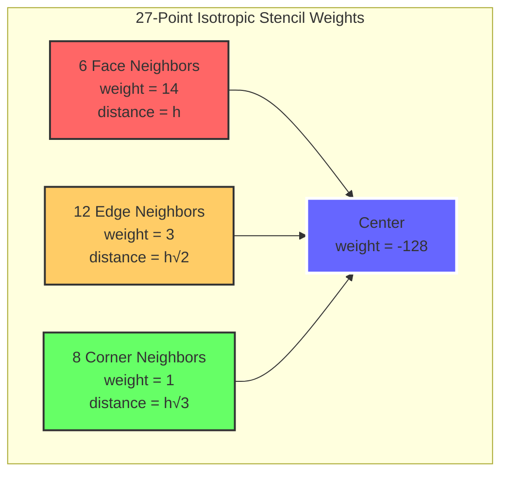

| Neighbor Type | Count | Distance | Weight | Total Contribution |
|---------------|-------|----------|--------|--------------------|
| Face          | 6     | `h`      | 4      | 24                 |
| Edge          | 12    | `h√2`   | 2      | 24                 |
| Corner        | 8     | `h√3`   | 1      | 8                  |
| Center        | 1     | 0        | -56    | -56                |

**Properties:**
- 4th-order isotropic (eliminates leading-order anisotropy artifacts)
- Requires `dx = dy = dz` (isotropic grid)
- 27 stencil points → higher bandwidth cost per point
- Better suited for dendritic growth where grid anisotropy is undesirable

**When to use which stencil:**
- **7-point**: Faster, works with anisotropic grids, sufficient for many problems
- **27-point**: More accurate for dendritic growth, eliminates grid-induced anisotropy

---

## 7. Gradient Operators

### 7.1 Second-Order Central Differences

```
∂φ/∂x ≈ (φ_{i+1} - φ_{i-1}) / (2·dx)
∂φ/∂y ≈ (φ_{j+1} - φ_{j-1}) / (2·dy)
∂φ/∂z ≈ (φ_{k+1} - φ_{k-1}) / (2·dz)
```

- Truncation error: `O(h²)`
- Stencil width: 3 points (±1)
- Used in the fused Allen-Cahn kernel for force computation

### 7.2 Fourth-Order Central Differences

```
∂φ/∂x ≈ (-φ_{i+2} + 8φ_{i+1} - 8φ_{i-1} + φ_{i-2}) / (12·dx)
```

| Stencil Point | Weight |
|---------------|--------|
| `i-2`         | `+1/12` |
| `i-1`         | `-8/12` |
| `i+1`         | `+8/12` |
| `i+2`         | `-1/12` |

- Truncation error: `O(h⁴)`
- Stencil width: 5 points (±2)
- Higher accuracy for smooth fields at the cost of wider halo requirement

---

## 8. Time Integration Schemes

The code implements four time integration schemes with increasing accuracy
and complexity.

### 8.1 Forward Euler (1st Order, 1 Stage)

The simplest explicit method:

```
φ^{n+1} = φ^n + Δt · f(φ^n, u^n)
u^{n+1} = u^n + 0.5·(φ^{n+1} - φ^n) + Δt·D·∇²u^n
```

**Butcher Tableau:**
```
0 |
--|---
  | 1
```

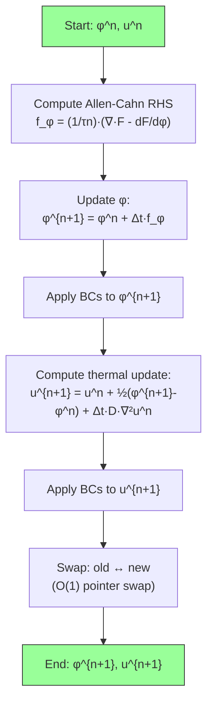

### 8.2 Heun's Method / RK2 (2nd Order, 2 Stages)

Heun's method is a predictor-corrector scheme:

```
Stage 1 (predictor):
  φ̃ = φ^n + Δt · f(φ^n, u^n)
  ũ = u^n + Δt · g(u^n, φ̃, φ^n)

Stage 2 (corrector):
  φ** = φ̃ + Δt · f(φ̃, ũ)
  u** = ũ + Δt · g(ũ, φ**, φ̃)

Average:
  φ^{n+1} = 0.5·(φ^n + φ**)
  u^{n+1} = 0.5·(u^n + u**)
```

This gives the correct formula: `y_{n+1} = y_n + (Δt/2)·(f₁ + f₂)`

**Butcher Tableau:**
```
0   |
1   | 1
----|------
    | 1/2  1/2
```

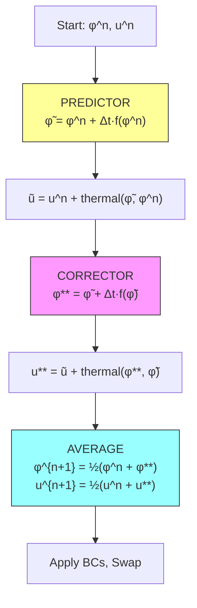

### 8.3 Classical RK4 (4th Order, 4 Stages)

The classical four-stage Runge-Kutta method:

```
k₁ = f(tₙ, yₙ)
k₂ = f(tₙ + Δt/2, yₙ + Δt/2·k₁)
k₃ = f(tₙ + Δt/2, yₙ + Δt/2·k₂)
k₄ = f(tₙ + Δt, yₙ + Δt·k₃)
y_{n+1} = yₙ + (Δt/6)·(k₁ + 2k₂ + 2k₃ + k₄)
```

After RK4 combination, latent heat is added:
```
u^{n+1} += 0.5·(φ^{n+1} - φ^n)
```

**Butcher Tableau:**
```
0   |
1/2 | 1/2
1/2 | 0    1/2
1   | 0    0    1
----|------------------
    | 1/6  1/3  1/3  1/6
```

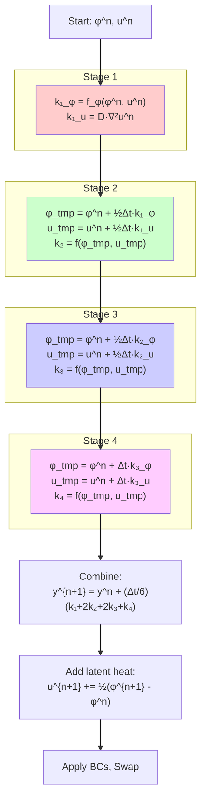

**Note:** The RK4 implementation uses the non-fused kernel path with separate
`Fx`, `Fy`, `Fz` force arrays, since each stage needs to evaluate the RHS at
intermediate points where precomputed forces are needed for efficiency.

### 8.4 IMEX (Implicit-Explicit)

The IMEX scheme treats different terms with different methods:
- **Explicit**: Allen-Cahn equation (nonlinear reaction + anisotropy)
- **Implicit**: Thermal diffusion (linear, stiff at small grid spacings)

```
Explicit step:
  φ^{n+1} = φ^n + Δt·f_AC(φ^n, u^n)    [fused Allen-Cahn kernel]

Implicit step:
  Solve: (I - Δt·D·∇²)·u^{n+1} = u^n + 0.5·(φ^{n+1} - φ^n)
```

The implicit system is solved via **Jacobi iteration** (50 iterations):

```
For iter = 1 to 50:
    u_new[c] = (rhs[c] + Δt·D·Σ_neighbors(u_old)) / (1 + 2·Δt·D·Σ(1/h²))
    swap(u_old, u_new)
```

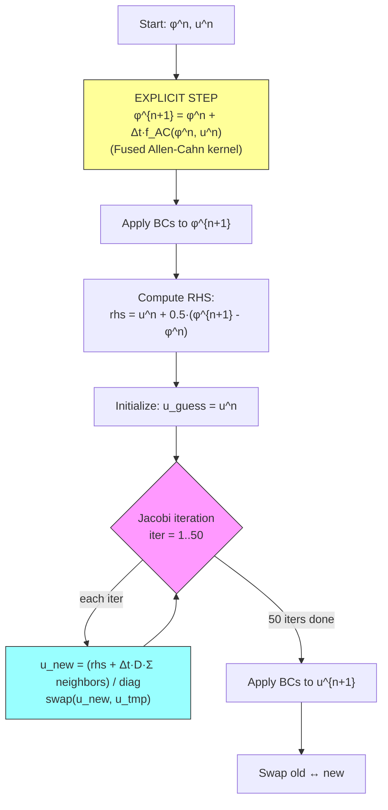

**Why IMEX?** The thermal diffusion term has a stability limit
`Δt ≤ h²/(2D·d)` which can be very restrictive for fine grids. Making it
implicit removes this constraint, allowing larger time steps while keeping
the nonlinear Allen-Cahn term explicit (where implicit treatment would
require a nonlinear solver).

---

## 9. Boundary Conditions

The code supports four types of boundary conditions, configurable independently
for each of the six domain faces.

### 9.1 Types

**Dirichlet (fixed value):**
```
φ|_Γ = g
```
Sets the field to a prescribed value at the boundary.

**Neumann (fixed flux):**
```
∂φ/∂n|_Γ = q
```
Zero-flux (`q=0`): `φ[boundary] = φ[interior]` (copies nearest interior value).
Non-zero flux: `φ[boundary] = φ[interior] ± q·h`.

**Periodic:**
```
φ[0] = φ[N-2]
φ[N-1] = φ[1]
```
Wraps the domain so opposite faces are connected.

**Robin (mixed):**
```
α·φ + β·∂φ/∂n = γ
```
General linear combination of Dirichlet and Neumann conditions.
Discretized: `φ[boundary] = (γ - (β/h)·φ[interior]) / (α + β/h)`
with guard against `|α + β/h| < 10⁻³⁰` to prevent division by zero.

### 9.2 Per-Face Configuration

Each of the 6 faces can have an independent BC type:

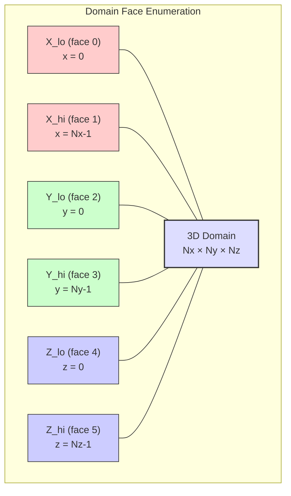

This enables complex simulation setups, e.g.:
- Periodic in X and Y, Neumann (insulating) in Z
- Dirichlet (fixed temperature) on one face, Neumann (adiabatic) on others
- Robin (convective heat transfer) on exposed surfaces

---

## 10. Stability Analysis

### 10.1 CFL Condition for Explicit Diffusion

The explicit treatment of diffusion imposes a stability limit:

```
Δt ≤ C_safety · h² / (2·D·d)
```

where:
- `h = min(dx, dy, dz)` — minimum grid spacing
- `D` — thermal diffusivity  
- `d = 3` — number of spatial dimensions
- `C_safety` — safety factor (typically 0.8–0.9)

For the 7-point Laplacian with equal spacing, the exact stability limit is:
```
Δt_max = h² / (2·D·3) = h² / (6D)
```

### 10.2 Jacobi Iteration Convergence

The Jacobi method for `(I - Δt·D·∇²)u = rhs` converges when the spectral
radius `ρ(M) < 1`, where `M` is the iteration matrix. For the standard
7-point Laplacian:

```
ρ(M) = max_k |Δt·D·λ_k / (1 + Δt·D·λ_max)|
```

where `λ_k` are the eigenvalues of the discrete Laplacian.

Convergence is guaranteed when `Δt·D/h²` is bounded. The code uses 50
iterations, which provides reliable convergence for typical simulation
parameters (convergence rate ~0.9 per iteration for moderately stiff problems).

### 10.3 Adaptive Time Stepping

The code implements adaptive time stepping based on the maximum rate of change:

```
ratio = target_tolerance / max|Δφ|
new_dt = current_dt · min(1.5, max(0.5, 0.9 · ratio))
new_dt = clamp(new_dt, dt_min, dt_max)
new_dt = min(new_dt, CFL_limit)
```

The growth/shrink factors (1.5 and 0.5) prevent oscillation, and the 0.9
safety factor provides a stability margin.

---

## 11. Kernel Fusion Optimization

The code implements an important GPU optimization: **kernel fusion** eliminates
intermediate global memory arrays for the force field.

### 11.1 Original Approach (Non-Fused)

```
Step 1: Compute Fx[i], Fy[i], Fz[i] for all grid points → 3 global arrays
Step 2: Compute ∇·F using Fx, Fy, Fz → read 3 arrays
Step 3: Update φ
```

Memory for 600³ grid: `3 × 600³ × 8 bytes ≈ 4.8 GB` just for force arrays.
Total GPU memory (with index + force + field arrays): ~16.0 GB.

### 11.2 Fused Approach

```
Step 1: For each grid point, compute F at (x,y,z) AND at 6 neighbors
        Compute ∇·F via central differences of the recomputed forces
        Update φ in the same kernel
```

Memory: **0 bytes** for force arrays (computed on-the-fly).
Total GPU memory: ~6.4 GB (53% reduction).

Trade-off: Each thread computes the force at 7 points instead of 1 (~7× more
ALU operations), but modern GPUs are bandwidth-limited, making this trade-off
highly favorable.

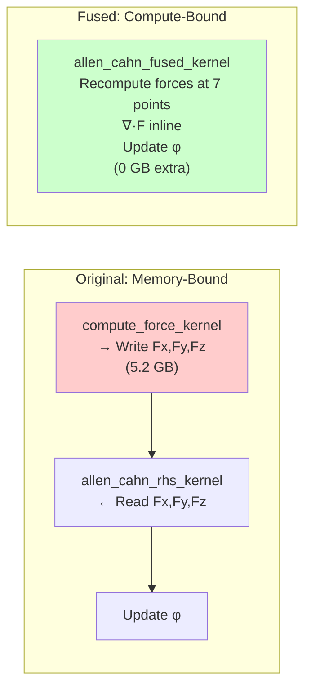

| Metric | Original | Fused | Improvement |
|--------|----------|-------|-------------|
| GPU Memory (600³) | 16.0 GB | 6.4 GB | **60% reduction** |
| Global Memory R/W | 3 arrays | 0 arrays | **Eliminated** |
| ALU per thread | 1× | ~7× | More compute |
| Bandwidth utilization | Bottleneck | Below limit | **Faster** |

---

## 12. Multi-GPU Domain Decomposition

For grids that exceed single-GPU memory, the code supports multi-GPU execution
via domain decomposition along the X axis.

### 12.1 Decomposition Strategy

The global domain of size `Nx × Ny × Nz` is split into `G` sub-domains along X:

```
GPU g gets: x ∈ [x_start_g, x_end_g)
Local size: (chunk_g + 2·halo_width) × Ny × Nz
```

where `chunk_g = Nx/G` (plus remainder distributed to first GPUs).

The **halo width is 2** because the fused Allen-Cahn kernel computes gradients
at neighbor points, giving an effective stencil reach of ±2.

### 12.2 Halo Exchange

Before each time step, neighboring GPUs exchange boundary data:

```
Left GPU:  interior right boundary → Right GPU: left halo
Right GPU: interior left boundary  → Left GPU: right halo
```

Data transfer uses `cudaMemcpyPeerAsync` for direct GPU-to-GPU copies (when
peer access is available) or staged copies via host memory (fallback).

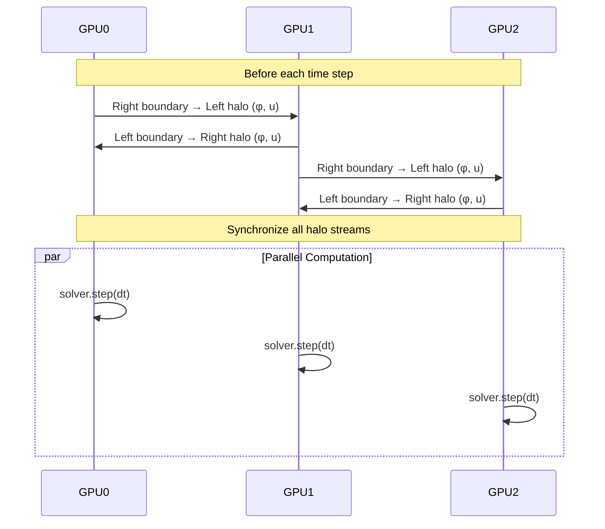

### 12.3 Result Gathering

After computation, results are gathered by copying each sub-domain's interior
(excluding halos) to the appropriate position in the global field:

```
For each GPU g:
    For lx in [halo, local_Nx - halo):
        gx = x_start_g + (lx - halo)
        global(gx, :, :) = local(lx, :, :)
```

---

## 13. Advanced Data Structures

The code uses several advanced data structures for performance and memory
optimization.

### 13.1 Thread-Safe LRU Cache

Used in `VTKWriter` for caching field statistics (mean, min, max, standard
deviation) to avoid redundant computation.

**Implementation:**
- Doubly-linked list (std::list) for LRU ordering
- Hash map (std::unordered_map) for O(1) key lookup
- `std::shared_mutex` for concurrent read access (readers don't block each other)
- Hit/miss counters for cache performance monitoring

**Complexity:**
| Operation | Time |
|-----------|------|
| Get (hit) | O(1) amortized |
| Get (miss) | O(1) |
| Put | O(1) amortized |
| Evict | O(1) |

### 13.2 Spatial Hash Map (FNV-1a)

3D spatial bucketing for efficient neighbor queries, useful for interface
tracking and adaptive refinement region identification.

**Hash function** (FNV-1a):
```
hash = 2166136261
hash = (hash XOR ix) × 16777619
hash = (hash XOR iy) × 16777619
hash = (hash XOR iz) × 16777619
bucket = hash % num_buckets
```

**Operations:**
- `insert(x, y, z, data)` — O(1) amortized
- `query(ix, iy, iz)` — O(k) where k = items in bucket
- `radius_query(x, y, z, r)` — O(m) where m = cells in radius

### 13.3 Concurrent Striped Hash Map

A thread-safe hash map with 16-stripe partitioning for low contention under
concurrent access.

**Design:**
- 16 independent hash map stripes
- Per-stripe `std::shared_mutex` (readers don't block per-stripe)
- Key → stripe mapping via hash: `stripe = hash(key) % 16`
- Contention reduced by factor of 16× vs single-lock design

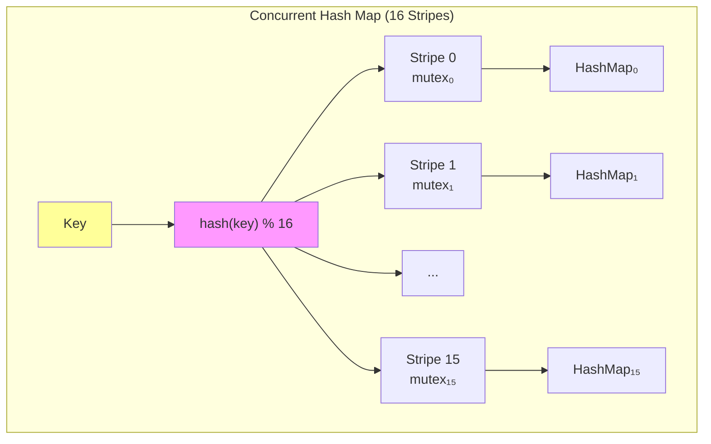

---

## 14. References

1. **Allen, S.M. and Cahn, J.W.** (1979). "A microscopic theory for antiphase
   boundary motion and its application to antiphase domain coarsening."
   *Acta Metallurgica*, 27(6), 1085–1095.

2. **Kim, S.G., Kim, W.T., and Suzuki, T.** (1999). "Phase-field model for
   binary alloys." *Physical Review E*, 60(6), 7186–7197.

3. **Karma, A. and Rappel, W.J.** (1998). "Quantitative phase-field modeling
   of dendritic growth in two and three dimensions." *Physical Review E*,
   57(4), 4323–4349.

4. **Provatas, N., Goldenfeld, N., and Dantzig, J.** (1998). "Efficient
   computation of dendritic microstructures using adaptive mesh refinement."
   *Physical Review Letters*, 80(15), 3308–3311.

5. **Patra, M. and Karttunen, M.** (2006). "Stencils with isotropic
   discretization error for differential operators." *Numerical Methods
   for Partial Differential Equations*, 22(4), 936–953. — Source for the
   27-point Laplacian weights `(14·face + 3·edge + 1·corner − 128·center)/(30·h²)`
   used in `src/cuda/Kernels.cuh::laplacian_27pt`.

6. **Plapp, M. and Karma, A.** (2003). "Multiscale finite-difference–
   diffusion–Monte-Carlo method for simulating dendritic solidification."
   *Journal of Computational Physics*, 165(2), 592–619.

6. **Kobayashi, R.** (1993). "Modeling and numerical simulations of dendritic
   crystal growth." *Physica D: Nonlinear Phenomena*, 63(3-4), 410–423.

7. **Boettinger, W.J., Warren, J.A., Beckermann, C., and Karma, A.** (2002).
   "Phase-field simulation of solidification." *Annual Review of Materials
   Research*, 32(1), 163–194.

8. **Karma, A.** (2001). "Phase-field formulation for quantitative modeling of
   alloy solidification." *Physical Review Letters*, 87(11), 115701.

---

## Appendix A: Summary of Notation

| Symbol | Meaning | Typical Value |
|--------|---------|---------------|
| `φ` | Phase-field order parameter | `[-1, +1]` |
| `u` | Dimensionless temperature | `[-δ, 0]` |
| `W₀` | Interface width | `1.0` |
| `τ₀` | Relaxation time | Derived |
| `λ` | Coupling constant | Derived |
| `δ` | Dimensionless undercooling | `0.1–0.8` |
| `D` | Thermal diffusivity | `1.0–10.0` |
| `ε` | Anisotropy strength | `0.0–0.33` |
| `A(n̂)` | Anisotropy function | `[1-3ε, 1+ε]` |
| `h` | Grid spacing | Problem-dependent |
| `Δt` | Time step | CFL-limited |

## Appendix B: Comparison of Time Integration Schemes

| Property | Euler | Heun (RK2) | RK4 | IMEX |
|----------|-------|------------|-----|------|
| Order of accuracy | 1 | 2 | 4 | 1 (AC) + implicit (thermal) |
| Stages per step | 1 | 2 | 4 | 1 + Jacobi iters |
| Memory overhead | Minimal | 2 extra fields | 8 extra fields + Fx,Fy,Fz | 2 extra fields |
| Stability | Conditional | Conditional | Conditional | Unconditional (thermal) |
| Cost per step | Low | 2× Euler | 4× Euler | 1× + 50 Jacobi |
| Best for | Quick tests | Moderate accuracy | High accuracy | Stiff thermal diffusion |

## Appendix C: GPU Memory Budget (600³ Grid)

| Buffer | Count | Size Each | Total |
|--------|-------|-----------|-------|
| `phi_old`, `phi_new` | 2 | 1.6 GB | 3.2 GB |
| `u_old`, `u_new` | 2 | 1.6 GB | 3.2 GB |
| Reduction scratch | 1 | 8 bytes | ~0 |
| **Euler total** | | | **6.4 GB** |
| + `phi_tmp`, `u_tmp` (Heun/IMEX) | 2 | 1.6 GB | +3.2 GB |
| **Heun/IMEX total** | | | **9.6 GB** |
| + `k1..k4_phi`, `k1..k4_u` (RK4) | 8 | 1.6 GB | +12.8 GB |
| + `Fx`, `Fy`, `Fz` (RK4 non-fused) | 3 | 1.6 GB | +4.8 GB |
| **RK4 total** | | | **27.2 GB** |
